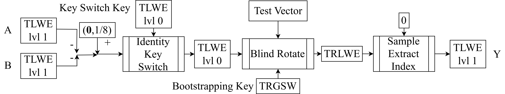

<!--
theme: default
size: 16:9
paginate: true
footer :  [licence](https://creativecommons.org/licenses/by-sa/4.0/)
style: |
  h1, h2, h3, h4, h5, header, footer {
        color: white;
    }
  section {
    background-color: #505050;
    color:white
  }
  table{
      color:black
  }
  code{
    color:black
  }
    a {
    font-weight:bold;
    color:#F00;
  }
-->

<!-- page_number: true -->

# Introduction to TFHE Implementation

## 0.Introduction

Kotaro Matsuoka

---
## Self Introduction

- PhD Student, Takashi Sato Lab, Graduate School of Informatics, Kyoto University
- Graduated from Department of Electrical and Electronic Engineering, Faculty of Engineering, Kyoto University
- Graduated from Tokyo Metropolitan Toyama High School
- 2019 MITOU Super Creator
- Kyoto University Machine Research Club (2019 NHK Student Robot Contest Winner)
- Undergraduate thesis: Electromagnetic field simulation including superconductors and magnetic materials
- Master's thesis: FPGA implementation of TFHE

---
## Goals

- To be able to implement TFHE's HomNAND and explain the underlying theory
- The visible goal is to create an implementation where HomNAND tests pass

---

## What is Homomorphic Encryption?

- Encryption that allows "computation on ciphertext"
- Operations homomorphic to operations on plaintext can be defined on ciphertext
- The concept was proposed in 1978 (same year as RSA, and two authros are shared)
- DARPA, Intel, IBM, Microsoft and others are competing in this field
- Trending application is Private AI for handling highly confidential data such as medical data
- There is a movement toward [standardization](https://homomorphicencryption.org/standard/)
  - [ISO/IEC 18033-6:2019(en) IT Security techniques — Encryption algorithms — Part 6: Homomorphic encryption](https://www.iso.org/obp/ui/#iso:std:iso-iec:18033:-6:ed-1:v1:en)

---

## What is TFHE?

- Stands for Fully Homomorphic Encryption over the Torus
- Ciphertext representing 0 and 1 can be subjected to any number of logical operations

---

## What is Fully Homomorphic Encryption?

- Abbreviated as FHE
- Encryption that allows applying "arbitrary" functions on ciphertext as input while keeping them encrypted
  - For integer ciphertext, a sufficient condition is being able to perform addition and multiplication any number of times
  - For bit ciphertext, a sufficient condition is being able to perform NAND any number of times
- TFHE follows the latter approach and can evaluate functions expressible as logic circuits

---

## Not-Fully Homomorphic Encryption

- Many HEs support operations on integers over modular rings
- PHE (Partial): HE that can only do addition or only multiplication
- SHE (Somewhat): Can do both, but there is a limit on the number of multiplications depending on the encryption scheme
- LHE (Leveled): Can do both, but there is a parameter-dependent limit on the number of multiplications

---

## Generations of FHE

- [Wikipedia](https://en.wikipedia.org/wiki/Homomorphic_encryption) has details
- 1st Generation FHE: Gentry's doctoral thesis (2009), etc.
- 2nd Generation FHE: Brakerski-Gentry-Vaikuntanathan (BGV, 2011), etc.
- 3rd Generation FHE: Craig Gentry, Amit Sahai, and Brent Waters (GSW, 2013) and TFHE (2016), etc.
- 4th Generation FHE: Cheon Jung Hee, Kim Andrey, Kim Miran, Song Yongsoo (CKKS, 2017)

---

## NAND

- A complete set of logical operations. The symbol and truth table are shown below.

|A＼B|0|1|
|---|---|---|
|0|1|1|
|1|1|0|

---

## Example of Logic Circuit (Half Adder)

---

## Conceptual Structure of HomNAND

---

## Chapter Structure

0. Introduction
1. TLWE
2. TRLWE & SampleExtractIndex
3. TRGSW & CMUX
4. Blind Rotate
5. Identity Key Switching
6. HomNAND
---

## Course Flow

- In each chapter, I'll explain the relevant theory before explaining the specific implementation method
- It's possible to implement just by looking at the [original paper](https://eprint.iacr.org/2018/421) and the original author's implementation. The lecture is for addressing common stumbling points
  - There are discrepancies in theory between the paper and implementation, and the lecture covers content closer to the implementation side
  - Some generality is sacrificed to simplify explanation

---

## About Implementation

- Languages that are easy to support are C, C++, Python
  - Rust is probably fine too
- The instructor develops on Linux (Ubuntu 24.04)
- The visible goal is to create an implementation where HomNAND tests pass

---

## Advanced Topics (1/4)

- Running a CPU on TFHE
  - The instructor's main research
- Integration with High Level Synthesis
  - These two are attempts to execute C language, etc., rather than directly designing logic circuits
- Implementation in FPGA, OpenCL, CUDA
  - There are attempts to create accelerators since there is a limit to the speed that can be achieved with CPU
- Application to Deep Learning
  - Trending

---

## Advanced Topics (2/4)

- Multi-Key implementation
  - In normal homomorphic encryption, there is one party that creates the key, but by having multiple parties create it, decryption can be made impossible without consent
- Switching with other FHEs
  - It is known that BFV, CKKS, and TFHE can be converted to each other
- Deterministic Weighted Finite Automaton
  - Automata can be evaluated with TFHE
- Circuit Bootstrapping
  - Conversion between TLWE and TRGSW

---

## Advanced Topics (3/4)

- Pass Transistor Logic
  - Utilizes the fact that External Product can be used as a switch
- Universal Circuit over TFHE
  - By constructing LUTs on encryption like FPGAs and connecting them, the circuit topology is revealed but the gate contents can be hidden
- Garbled Circuit over TFHE
  - Evaluating GC on homomorphic encryption (actually AES decryption circuit) can resolve malleability (it's impossible to distinguish whether the evaluation on homomorphic encryption is different from what was requested)

---

## Advanced Topics (4/4)

- Automatic parameter selection
  - Since TFHE security parameters have a trade-off between performance and security, we want to decide them automatically
- Programmable Bootstrapping
  - Implementation of Bootstrapping that takes integers and returns integers
- Batch Bootstrapping
  - Bootstrapping multiple LWEs at once
- Key compression
  - Replace the nonce part of the key with a CSPRNG seed

---

## References

- [C++ implementation (by the author)](https://github.com/virtualsecureplatform/TFHEpp)
- [Python implementation (by the author)](https://github.com/virtualsecureplatform/pyFHE/tree/PurePython)
- [CUDA implementation (forked by the author)](https://github.com/virtualsecureplatform/cuFHE)
- [C++ implementation (by 2020 tutor, probably most faithful to the slides)](https://github.com/ushitora-anqou/aqtfhe3)
- [C++ implementation (by original paper authors)](https://github.com/tfhe/tfhe)
- [C++ implementation (academic)](https://github.com/openfheorg/openfhe-development)

---

- [Rust implementation (by Zama, Zama is a company founded by the original authors)](https://github.com/zama-ai/tfhe-rs)
- [Julia implementation (by NuCypher)](https://github.com/nucypher/TFHE.jl)
- [Ruby implementation (by Klemsa)](https://gitlab.fit.cvut.cz/klemsjak/wtfhe)
- [Original paper](https://eprint.iacr.org/2018/421)
- [Explanation article by Zama](https://www.zama.ai/post/tfhe-deep-dive-part-1)
