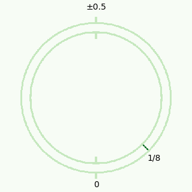
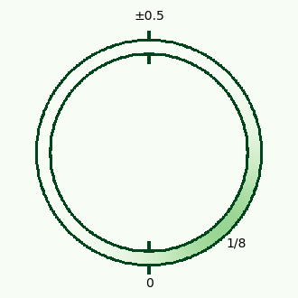
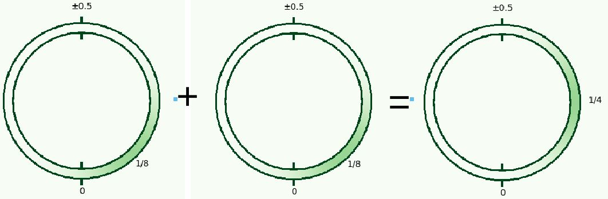

<!--
theme: default
size: 16:9
paginate: true
footer :  [licence](https://creativecommons.org/licenses/by-sa/4.0/)
style: |
  h1, h2, h3, h4, h5, header, footer {
        color: white;
    }
  section {
    background-color: #505050;
    color:white
  }
  table{
      color:black
  }
  code{
    color:black
  }
    a {
    font-weight:bold;
    color:#F00;
  }
-->

<!-- page_number: true -->

# Introduction to TFHE Implementation

## 1.TLWE

Kotaro Matsuoka

---

## Position of Explained Content in HomNAND

- lvl1 will be explained next time, so for now TLWE means lvl0

---

## What is TLWE

- Stands for Torus Learning With Errors
- Means LWE encryption using Torus
- LWE is explained in the next slide

---

## What is LWE

- Integer LWE, which takes values in quotient rings, is commonly used
  - Its extension was selected for [NIST PQC](https://csrc.nist.gov/Projects/post-quantum-cryptography/selected-algorithms-2022) as post-quantum cryptography
- As the name suggests, Error plays an important role
  - There are multiple ways to handle Error
  - When you can obtain as many ciphertexts with known plaintext as you like (IND-CPA), if there is no Error, you can find the secret key by calculating the inverse of the matrix obtained by arranging $\mathbf{a}$ of the obtained ciphertexts
    - With Error, it deviates from a simple inverse matrix problem, and the larger the Error, the harder it becomes
    - With real numbers it would be least squares, but it's harder because some discretization is involved
- The larger the matrix size, the harder it is, so the ciphertext size ($n$) also contributes to security
  - "Mathematical Foundations for Lattice Cryptanalysis" is good for specific attack methods
  - kurenaif, who was a Security Camp instructor in the past, has a [video](https://www.youtube.com/watch?v=Uktq1RYVtbo)

---

## Intuitive Definition of Torus

- Also known as circle group, written as $\mathbb{T}$.
- It's good to imagine the angle of a clock hand
- As a concrete number, it's the angle of the hand divided by 2π

---

## What is Torus

- Here, we define it as $\mathbb{R} \bmod 1$. That is, the fractional part of a real number, taking values in $[0,1)$ or $[-0.5,0.5)$
  - For understanding the theory, $[-0.5,0.5)$ alone is sufficient
  - $[0,1)$ may be more efficient in implementation
- Multiplication between Torus values is not defined, but addition is
- Example of addition: $0.8+0.6=1.4≡0.4 \bmod 1$, $0.3-0.9=-0.6 ≡ 0.4 \bmod 1$
- Multiplication cannot be defined. Example: Since $1.2≡0.2 \bmod 1$ and $2.4≡0.4 \bmod 1$, if multiplication could be defined, $1.2⋅ 2.4=2.88≡0.2⋅0.4=0.08\bmod 1$, but this doesn't hold
- Multiplication with integers ($\mathbb{Z}$) can be defined. Example: $3⋅ 0.4≡ 0.2 \bmod 1$

---

## Modular Gaussian Distribution

- Used in the original TFHE paper
- Normal distribution samples take values in real numbers ($\mathbb{R}$), but this takes values in Torus
  - Discrete Gaussian distribution is defined on integers, but this is Torus
  - Since actual implementation approximates to integers, there's an argument that discrete Gaussian distribution or CBD should be used
  - Uniform distribuiton is another option, since we can define it naturally in Torus
- Samples from normal distribution taken $\bmod 1$ give modular normal distribution
  - Using this for error is most standard (not best) in TFHE

---

## Specific Construction of TLWE (when plaintext is Torus)

- $\mathbb{B}=\{0,1\}$ is the set of binary values. $\mathbb{B}⊂ \mathbb{Z}$
- Two parameters determine encryption security: $n∈\mathbb{Z}^+,α∈\mathbb{R}^+$
- Let $U_{\mathbb{T}^n}$ be the uniform distribution taking $n$ values independently from $\mathbb{T}$
- Let $\mathcal{D}_{\mathbb{T},α}$ be the modular normal distribution with mean $0$ and standard deviation $α$
- Let $\mathbf{a}∈ \mathbb{T}^n$, $e,b∈ \mathbb{T}$, $\mathbf{s}∈ \mathbb{B}^n$, $m∈ \mathbb{T}$
- $m$ is plaintext, $\mathbf{a}←U_{\mathbb{T}^n}$, $e←\mathcal{D}_{\mathbb{T},α}$, $\mathbf{s}←U_{\mathbb{B}^n}$
- Ciphertext is $(\mathbf{a},b)$, an $n+1$ element vector, where $b=\mathbf{a}⋅ \mathbf{s}+ m +e$
- Since $b-\mathbf{a}⋅\mathbf{s}=m+e$, if we add a method to remove $e$, we can extract $m$ and decrypt
- The larger $n$ and $α$, the more secure (if $α$ is too large, the ciphertext breaks)

---

## Visual Image (Noise from Encryption)

|Plaintext|With Noise|
|---|---|
|||

- As emphasized, the probability of decryption error is not zero (negligible in practice)
  - Generally, below $2^{-40}$ is considered acceptable
  - It's said that this is about the error probability on a typical PC

---

## Additive Homomorphism of TLWE

- Consider two ciphertexts $(\mathbf{a}_1,b_1)$, $(\mathbf{a}_2,b_2)$, and let their sum be $(\mathbf{a}_1+\mathbf{a}_2,b_1+b_2)$
- $b_1+b_2-(\mathbf{a}_1+\mathbf{a}_2)⋅\mathbf{s}=m_1+m_2+e_1+e_2$, and since $m_1+m_2$ appears, we can see additive homomorphism
- Since the error also becomes $e_1+e_2$, there is a limit to the number of additions that can be performed
  - If the error is too large, the probability of decryption error increases

---

## Specific Construction of TLWE (when plaintext is binary)

- Let $m∈ \mathbb{B}$, $μ=1/8\in\mathbb{T}$
- $μ(2⋅ m-1)∈\mathbb{T}$
- TLWE ciphertext is $b=\mathbf{a}⋅ \mathbf{s}+μ(2⋅ m-1)+e$
- Decryption is $(1+\mathit{sgn}(b-\mathbf{a}\cdot\mathbf{s}))/2$ ($\mathit{sgn}$ is the sign function)
- During decryption, $\mathbb{T}=[-0.5,0.5)$

---

## Visual Image (Addition without Noise)

---

## Visual Image (Addition with Noise)

---

## Idea of Binary Operations

- Plaintext encoded in Torus is {-1/8, 1/8}
- Plaintext of sum of two TLWEs is {-1/4, 0, 1/4}
- Subtracting this from $(\mathbf{0},1/8)$ gives {-1/8, 1/8, 3/8}
- -1/8 occurs when both ciphertexts are 1 as binary plaintext
- 3/8 when both are 0, 1/8 when the two are different
- When decrypting this ciphertext, negative signs become 0, positive signs become 1
- That is, it becomes 0 only when both input ciphertexts are 1, so it's NAND
  - ∴ If decryption can be evaluated on ciphertext, NAND can be computed on ciphertext

---

## Visual Image (All Patterns of Addition without Noise)

- When subtracting the sum of two inputs from $(\mathbf{0},1/8)$, only when both are 1 is it in the left half
- Becoming 0 only when both are 1 is exactly NAND
  - The signs and constant values for the initial addition/subtraction are determined this way
  - Other 2-input logic gates can be made by choosing similarly

---

## Bootstrapping

- The operation of removing error by evaluating the decryption function on homomorphic encryption
- Craig Gentry first proposed this and gave a construction
  - All current fully homomorphic encryptions are constructed by this
  - In TFHE, the operation called Blind Rotate is essentially Bootstrapping

---

## Implementation of Torus

- Since it's a set of fractional parts of real numbers, one naturally wants to implement it with double-precision floating-point numbers
  - However, $\bmod 1$ with floating-point numbers is heavy
- Therefore, we use fixed-point numbers where the decimal point is before the most significant bit
- Example: For 8-bit width, $0.5$ is $0b1000000$, $0.375$ is $0b01100000$
- With this method, the integer part from addition or multiplication is discarded by overflow, so modulo operation is not needed
- Example: For 8-bit width, $0.5+0.625 \bmod 1=0b1000000+0b10100000=0b0010000=0.125 \bmod 1$
- The width of the fixed-point number should be sufficient to express $e$
  - That is, the sufficient width is determined by the standard deviation of the modular normal distribution

---

## Implementation of Real Number and Torus Conversion

- Implementation of modular normal distribution requires conversion between real numbers and Torus
- Ideally, it's the operation of extracting the fractional part of a real number
- Let the operation to extract the integer part of a real number be $\mathrm{int}()$, the fixed-point width be $w$, and the input real number be $d$
- To extract just the fractional part of a real number, $d \mod{1}$ is sufficient
- Actually, since we want a fixed-width fixed-point number, we extract the top $w$ digits of the real number as an integer
- The operation we want to implement can be written as the following formula

$$
\mathrm{int}((d \mod{1})⋅2^w)
$$

---

## Centered Binomial Distribution (CBD)

- One of the noise distributions used besides modular normal distribution
  - Discrete normal distribution is also commonly used
  - Since it cannot be defined on Torus, it can only be used after discretizing Torus
- Defined using random variables $a_i,b_i$ that take 0 or 1 with equal probability
$$\sum_{i=0}^{\eta-1} a_i - b_i$$
- $\eta$ is a parameter, and as it increases, the tail widens
- Advantages are ease of computation and bounded value range

---

## About TLWE Parameters

- In this lecture, we introduce values currently estimated to be 128-bit security
- $n=636$, $\alpha=0.0000925119974676756$ or $\eta=40$, fixed-point width is 16 bits
- TLWE security reduces to LWE security problem, so LWE estimation methods can be used
  - Theory is explained with Torus, but implementation uses quotient ring with modulus $2^{16}$
    - In that sense, discrete normal distribution or CBD should be used rather than modular normal distribution
  - Which is more essential, quotient ring or Torus? (I sometimes wonder)
- [LWE Estimator](https://github.com/malb/lattice-estimator) is the de facto standard for security evaluation
  - Code example for security estimation is [here](https://tfhe.github.io/tfhe/security_and_params.html)

---

## About Random Number Generation

- Encryption security is greatly affected by random number quality
- Mersenne Twister should not be used (Pokemon RNG manipulation)
  - The original paper author's implementation uses it, but don't imitate
- The safest is to use random numbers provided by the OS (on Linux, /dev/urandom)
- Pseudorandom numbers whose cryptographic security is guaranteed are called CSPRNG (Cryptographically Secure PseudoRandom Number Generator)
  - TFHEpp uses [BLAKE3](https://github.com/BLAKE3-team/BLAKE3)'s eXtended Output Function (XOF) mode

---

## Minimum Implementation for TLWE

- Just list what's needed to make HomNAND, so whether to make it more general is up to design philosophy
- Just implement encryption and decryption limited to binary plaintext
- Addition of ciphertexts is used later, so it's good to hold data in a way that makes vector-like addition easy
  - TFHEpp holds it with std::array, but overloading operators with classes is more common
    - Depending on your philosophy
  - The form $(b,\mathbf{a})$ rather than $(\mathbf{a},b)$ is more common
    - Recently I feel this is slightly more efficient in terms of memory access
- Parameters should be written so they can be easily changed later for higher versatility