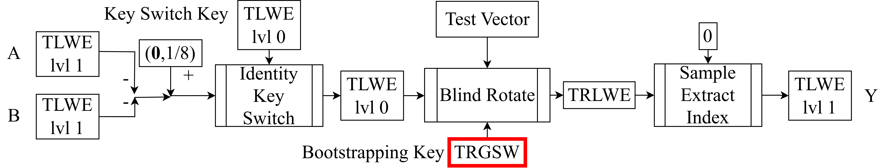

<!--
theme: default
size: 16:9
paginate: true
footer :  [licence](https://creativecommons.org/licenses/by-sa/4.0/)
style: |
  h1, h2, h3, h4, h5, header, footer {
        color: white;
    }
  section {
    background-color: #505050;
    color:white
  }
  table{
      color:black
  }
  code{
    color:black
  }
    a {
    font-weight:bold;
    color:#F00;
  }
-->

<!-- page_number: true -->

# Introduction to TFHE Implementation

## 3.TRGSW & CMUX

Kotaro Matsuoka

---

## Position of Explained Content in HomNAND

- CMUX plays a central role in Blind Rotate explained next time



---

## What is TRGSW

- Stands for Torus Ring-GSW
- GSW is taken from the initials of the inventors Craig Gentry, Amit Sahai, and Brent Waters
  - https://eprint.iacr.org/2013/340
- GSW is a type of fully homomorphic encryption, and TRGSW is its extension to Torus coefficient polynomials
  - Original is Integer LWE
- Understanding TRGSW is particularly important for understanding TFHE

---

## Product of Integer Polynomial Diagonal Matrix and TRLWE

- If we suddenly look at the specific construction of TRGSW, we won't understand the motivation
- We derive TRGSW by constructing the operations we want to do with TRGSW
- We want to do the following operation without decryption (polynomial multiplication on homomorphic encryption)
  - We've already seen that addition is possible
  - For simplicity, we assume $k=2$ here
- The matrix part somehow becomes ciphertext, which is TRGSW

$\begin{aligned}
μ[X]&∈\mathbb{Z}_N[X]\\
μ[X]⋅(a_0[X],a_1[X],b[X])&=(a_0[X],a_1[X],b[X])⋅
\left(
    \begin{array}{ccc}
      μ[X] & 0 & 0\\
      0 & μ[X] & 0\\
      0 & 0 & μ[X]\\
    \end{array}
  \right)
\end{aligned}$

---

## Scaling

- There are three important ideas in the construction of TRGSW, one being scaling
  - The naming for three ideas is my own words, not standard
- Ciphertext considered in TFHE cannot directly use integer coefficient polynomials as plaintext
- Make the matrix Torus coefficients and push that amount to TRLWE to round to integer coefficients
  - Note that noise increases by the amount of rounding
- $Bg\in\mathbb{Z}$, $Bg>μ[X]$, $e_r[X]∈\mathbb{T}_N[X]$
- $e_r[X]$ is noise from rounding

---

- Note that noise is multiplied by $μ[X]$
$\begin{aligned}
⌈Bg⋅(a_0[X],a_1[X],b[X])⌋⋅&
\left(
    \begin{array}{ccc}
      \frac{μ[X]}{Bg} & 0 & 0\\
      0 &  \frac{μ[X]}{Bg}  & 0\\
      0 & 0 & \frac{μ[X]}{Bg}
    \end{array}
  \right)=(a_0^r[X],a_1^r,b^r[X])\\
  &≈μ[X]⋅(a_0[X],a_1[X],b[X])\\
  b^r[X]-\mathbf{a}^r[X]⋅\mathbf{s}[X] &= μ[X](b[X] - \mathbf{a}[X]⋅\mathbf{s}[X]+e_r[X])
\end{aligned}$

---

## Zero Matrix Addition

- Hide the matrix by adding TRLWE encrypting 0 to the matrix (mask with ciphertext)
  - The matrix after addition can be interpreted as a vector of TRLWE
- $(\mathbf{a}_i[X],b_i[X])$ is TRLWE encrypting 0
- That is, $b_i[X]-\mathbf{a}_i[X]⋅s[X]=0+e_i[X]$
  - Adding a constant multiple of 0 ciphertext is still 0 ciphertext with increased noise

$
\begin{array}{cc}
&⌈Bg⋅(\mathbf{a}[X],b[X])⌋⋅[
\left(
    \begin{array}{ccc}
      \frac{μ[X]}{Bg} & 0 & 0\\
      0 & \frac{μ[X]}{Bg} & 0\\
      0 & 0 & \frac{μ[X]}{Bg}
    \end{array}
  \right)+
  \left(
    \begin{array}{cc}
      \mathbf{a}_0[X] & b_0[X] \\
      \mathbf{a}_1[X] & b_1[X] \\
      \mathbf{a}_2[X] & b_2[X]
    \end{array}
  \right)]\\
  ≈&μ[X]⋅(\mathbf{a}[X],b[X])+⌈Bg⋅a_0[X]⌋⋅(\mathbf{a}_0[X],b_0[X])\\
  &+⌈Bg⋅a_1[X]⌋⋅(\mathbf{a}_1[X],b_1[X])+⌈Bg⋅b[X]⌋⋅(\mathbf{a}_2[X],b_2[X])
\end{array}
$

<!-- ---

## What's Happening

- This is $k=1$ for space reasons
 -->

---

## Trade-off Regarding $Bg$

- The maximum value of coefficients of $⌈Bg⋅a[X]⌋$, $⌈Bg⋅b[X]⌋$ is $Bg$
- That is, increasing $Bg$ increases the influence of noise from 0 ciphertext
- However, decreasing $Bg$ increases rounding noise
- Escaping this trade-off is Decomposition

---

## Decomposition (General Definition)

- When rounding TRLWE, decompose it into $l$ digits treating $Bg$ as the radix
  - Can reduce rounding noise without increasing $Bg$
- Decomposition takes a polynomial $a[x]∈T_N[X]$ as input
- Returns a vector of polynomials $\mathbf{ā}[X]∈(\mathbb{Z}_N[X])^l$ as output
  - Element polynomials have coefficients that are extracted one digit from the input polynomial coefficients
  - Vector elements are arranged as: collection of top digits when Torus is expressed in base $Bg$, then next digits, etc.

---

- $ā_{ij}$ satisfies $\mathop{\rm arg~min}\limits_{ā_{ij}} ∑^{N-1}_{j=0}(a_j-∑_{i=1}^{l}\frac{ā_{ij}}{Bg^i})^2\ s.t.\ ā_{ij}∈[-\frac{Bg}{2},\frac{Bg}{2})$
  - Taking $[-\frac{Bg}{2},\frac{Bg}{2})$ instead of $[0,Bg)$ is to reduce noise
- Let $ā_i[X]$ be a polynomial whose $0≤j≤N-1$ degree coefficient is $ā_{ij}$
- Return polynomial vector $\mathbf{ā}[X]$ with $ā_i[X]$ as the $1≤i≤l$-th element
---

## What Decomposition Creates

- Let's get an image by looking at the inverse operation first
  - Made $k=1$ for space reasons
- $⌈Bg⋅(a[X],b[X])⌋$ becomes Decomposition for the case $l=1$

$
(a[X],b[X])≈ (ā_1[X],...,ā_l[X],b̄_1[X],...,b̄_l[X])
\left(
    \begin{array}{cc}
      \frac{1}{Bg} & 0 \\
      ⋮ & ⋮\\
      \frac{1}{Bg^l} & 0 \\
      0 & \frac{1}{Bg}\\
      ⋮&⋮\\
      0 & \frac{1}{Bg^l}\\
    \end{array}
\right)
$

---

## Decomposition (Specific Construction)

- Let's show an algorithm that specifically gives $ā_i[X]$
  - For simplicity, limited to cases where $Bg=2^{Bgbit}$ can be written
  - Assume Torus is represented as uint32_t
- If $[-\frac{Bg}{2},\frac{Bg}{2})$, we need to consider cases where coefficients are negative
- By adding $\frac{Bg}{2}$ to each digit, shift to $[0,Bg)$
- This way, we just need to extract with bit mask
- Finally, subtract $\frac{Bg}{2}$ from each coefficient to restore

---

## Decomposition (Basic Idea)

- As a premise, if taking each digit in range $[0,Bg)$, mask alone is sufficient
  - Let the case of taking in $[0,Bg)$ be $â$
  - That is, $â_{ij}=(((aᵢ+2^{32-Bgbit⋅l-1})>>(32-Bgbit⋅i))\&(Bg-1))$
  - $2^{32-Bgbit⋅l-1}$ is a constant for rounding
  - This satisfies $\mathop{\rm arg~min}\limits_{\hat{a}_{ij}} ∑^{N-1}_{j=0}(a_j-∑_{i=1}^{l}\frac{\hat{a}_{ij}}{Bg^i})^2\ s.t.\ \hat{a}_{ij}\in[0,Bg)$
- Consider conversion from $a[X]$ to $\mathbf{ā}[X]$ via $\mathbf{â}[X]$
  - $ā_{ij}$ can be determined to satisfy the following relationship (essentially carrying)
$$
â_{ij} = \begin{cases} Bg+ā_{ij}\qquad if\quad â_{ij}≥\frac{Bg}{2}\\ ā_{ij}\qquad otherwise\end{cases}
$$

---

## Decomposition (Pseudocode)

- Let's show pseudocode for naive implementation of this idea
  - Optimization is possible to entrust the carry calculation to an adder, but it's too complex so not explained here
  - Assumes Torus is represented in 32-bit fixed-point
  - Separated to match the formula, but â can be updated and returned

---

```
Decomposition(a[X])
  roundoffset = 1 << (32 - l * Bgbit - 1)
  for i from 1 to l
    for j from 0 to N-1
      âᵢⱼ=(((aⱼ+roundoffset)>>(32-Bgbit*i))&(Bg-1))
  for i from l to 1
    for j from 0 to N-1
      if âᵢⱼ ≥ Bg/2
        āᵢⱼ = âᵢⱼ - Bg
        â₍ᵢ₋₁₎ⱼ += 1
      else
        āᵢⱼ = âᵢⱼ
  return 𝐚̄[X]
```
---

## Specific Construction of TRGSW (when plaintext is $\mathbb{Z}_N[X]$)

- Considering applying Decomposition to TRLWE and multiplying, ciphertext for $k=1$ is as follows
  - Actually, plaintext space being only $\mathbb{B}$ is enough to create HomNAND
$
\left(
    \begin{array}{cc}
      \frac{μ[X]}{Bg} & 0 \\
      ⋮ & ⋮\\
      \frac{μ[X]}{Bg^l} & 0 \\
      0 & \frac{μ[X]}{Bg}\\
      ⋮&⋮\\
      0 & \frac{μ[X]}{Bg^l}\\
    \end{array}
\right)+
\left(
    \begin{array}{cc}
      a_1[X] & b_1[X] \\
      ⋮ & ⋮\\
      a_l[X] & b_l[X] \\
      a_{l+1}[X] & b_{l+1}[X]\\
      ⋮&⋮\\
      a_{2l}[X] & b_{2l}[X]\\
    \end{array}
\right)
$

---

## Trade-off Regarding $l$

- Increasing $l$ can reduce rounding noise
- Increasing $l$ increases noise from 0 ciphertext
- $l$ affects rounding exponentially and 0 ciphertext linearly
- Increasing $l$ makes External Product heavier with more polynomial multiplications
- The trade-off manifests differently from $Bg$

---

## External Product

- Product of TRLWE and TRGSW
- Let TRGSW be $\mathbf{C}$ and write the case $k=2$ ($\mathrm{Decomp}$ is abbreviation of $\mathrm{Decomposition}$)
- Incidentally, Internal Product refers to product of TRGSWs, but we don't use it so it's omitted
$
\mathbf{C}⊡ (\mathbf{a}[X],b[X]):=(\mathrm{Decomp}(a_0[X]),\mathrm{Decomp}(a_1[X]),\mathrm{Decomp}(b[X]))⋅\mathbf{C}
$

---

## CMUX

- Stands for Controlled MUX apparently
- Using External Product, we can create a multiplexer
  - Let plaintext space of TRGSW ($\mathbf{C}$) be $\mathbb{B}$
  - If TRGSW plaintext is 0, $(a_0[X],b_0[X])$ is selected; if 1, $(a_1[X],b_1[X])$ is selected
- Noise increases each time CMUX is done, so there's a limit on the number of times
- Even just this can create Weighted Finite Automata, but omitted

$\mathbf{C}⊡ [(\mathbf{a}_1[X],b_1[X])-(\mathbf{a}_0[X],b_0[X])]+(\mathbf{a}_0[X],b_0[X])$

---

## About TRGSW Parameters

- $k=2$, $Bgbit=8$, $l=2$
  - Note that $k$ must match TRLWE
  - Easier to match noise too (not that they can't be independent)
- Actually, $k=3$, $Bgbit=18$, $l=1$, 64-bit fixed-point might also work
  - Can't definitively say this parameter is faster at this point
  - Implementation becomes simpler with no Decomposition, one could say
- Actually, it's known that having different $l$ for applying to $b[X]$ vs $\mathbf{a}[X]$ is good
  - https://eprint.iacr.org/2023/771
  - There's also a method to switch $l$ according to noise amount of TRLWE being computed with
- No attack is known that exploits correlation in plaintext across TRGSW rows
- Current security is evaluated by security of TRLWE per row (reduces to LWE)

---

## Minimum Implementation for TRGSW

- TRGSW encryption with plaintext as $\mathbb{B}$ (decryption not needed)
- External Product
- CMUX
