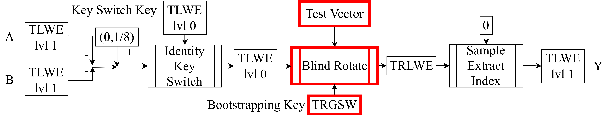
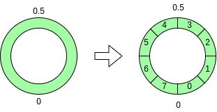
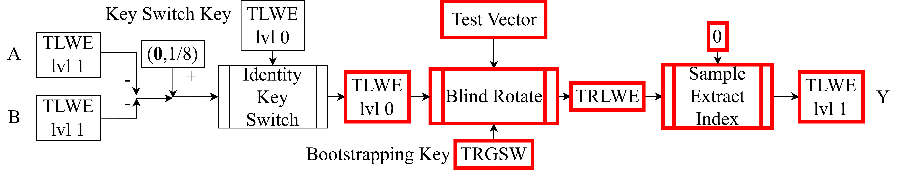

<!--
theme: default
size: 16:9
paginate: true
footer :  [licence](https://creativecommons.org/licenses/by-sa/4.0/)
style: |
  h1, h2, h3, h4, h5, header, footer {
        color: white;
    }
  section {
    background-color: #505050;
    color:white
  }
  table{
      color:black
  }
  code{
    color:black
  }
    a {
    font-weight:bold;
    color:#F00;
  }
-->

<!-- page_number: true -->

# Introduction to TFHE Implementation

## 4.Blind Rotate

Kotaro Matsuoka

---

## Position of Explained Content in HomNAND



---

## What is Blind Rotate

- Homomorphic operation to "rotate" a polynomial (TRLWE)
  - "Rotation" essentially means multiplying by a power of $X$
  - The power exponent is determined by TLWElvl0
- Takes as input one TRLWE, one TLWElvl0, and $n$ TRGSWs
  - The input TRLWE is specially called Test Vector
  - These $n$ TRGSWs are called Bootstrapping Key, encrypting the lvl0 secret key bit by bit
- By choosing Test Vector, we can create a function from TLWElvl0 to TRLWE
  - Combined with Sample Extract Index, we can create a function from TLWElvl0 to TLWElvl1
  - ∵ Blind Rotate changes the position and sign of TRLWE coefficients according to TLWElvl0 value, so the value extracted by Sample Extract Index changes

---

## Rounding TLWE

- The power exponent must be an integer, so we need to round TLWE
  - The range meaningful as an exponent is $[0,2N)$
    - ∵ $X^{2N}⋅a[X]≡a[X] \mod{X^{N}+1}$
  - ∴ If we multiply TLWE by $2N$ and round each coefficient to $[0,2N)$, we can get a meaningful value
- Since it returns to the original at $X^{2N}$, the rounded value can be viewed as a value on the quotient ring modulo $2N$

---

- We want to use $⌊2N⋅(b-\mathbf{a}⋅\mathbf{s})⌋\mod{2N}$ but can't leak the secret key
  - Floor function is used so that values rounding to $0$ are in $[0,1/2N)$
  - $⌊2N⋅(b-\mathbf{a}⋅\mathbf{s})⌋\mod{2N}$$≈⌊2N⋅b⌋-∑_{i=0}^{n-1}⌈2N⋅a_i⌋⋅s_i \mod{2N}=ρ$
  - Since $⌈2N⋅a_i⌋$ is computable, if we can compute the product with $s_i$, $ρ$ is computable

 Figure is example for $N=4$

---

## Idea of Blind Rotate

- The operation we want to realize is multiplying given TRLWE by $X^{-\rho}$
  - Negative sign is just because it's cleaner
  - When $\rho\in [0,N)$, the degree $N$ term comes to the constant term
- We want to compute $⌈2N⋅a_i⌋⋅s_i$ without revealing the secret key
  - Encrypt secret key in TRGSW (Bootstrapping Key) and reflect each bit's value with CMUX

---

## Specific Algorithm for Blind Rotate

- Let $N=2^{Nbit}$ (in this lecture's recommended parameters, $Nbit=9$)
```
BlindRotate((𝐚,b),𝐁𝐊,(𝐚[X],b[X]))
  b̃= b >> (32-Nbit-1)) //this is floor
  trlwe = X⁻ᵇ̃⋅(𝐚[X],b[X])
  for i from 0 to n-1
    ã=(aᵢ + (1<<(31-Nbit-1)) ) >> (32-Nbit-1) //addition is for rounding
    trlwe = CMUX(𝐁𝐊ᵢ,Xᵃ̃⋅trlwe,trlwe)//Dec(𝐁𝐊ᵢ)?Xᵃ̃⋅trlwe:trlwe
  return trlwe
```
---

## GateBootstrapping TLWE to TLWE (Overview)

- Name of the operation that performs Blind Rotate with TRLWE where all plaintext coefficients are $1/8$ as input, and extracts the constant term of the output with Sample Extract Index
  - When $ρ∈[0,N)$, $1/8$ comes to constant term; when $[N,2N)$, $-1/8$
  - This is a kind of sign function (decryption itself of ciphertext)
- Noise of output TLWElvl1 becomes constant regardless of TLWElvl0 noise
  - ∵ TLWElvl1 noise is fixed, only from $n$ CMUXes (Bootstrapping)
  - But still need to convert TLWElvl1 to TLWElvl0, in next lecture
 
---

## Trivial Ciphertext

- TRLWE (Test Vector) that can extract $1/8$ in $[0,N)$ and $-1/8$ in $[N,2N)$ is a ciphertext where all plaintext coefficients are $1/8$
  - Encrypting this means sending a ciphertext with known plaintext, and noise also increases
- Actually, setting $b[X]$ as the Torus coefficient polynomial of plaintext itself and $\mathbf{a}[X]$ as $\mathbf{0}$ is also a valid ciphertext
  - Since it's a ciphertext that can be generated without secret key or random number generator, it's called trivial ciphertext
  - Of course, it can't protect information, so its use is limited
- Instead of defining this, operations with plaintext can be defined

---

## GateBootstrapping TLWE to TLWE (Pseudocode)

```
GateBootstrappingTLWEtoTLWE((𝐚,b),𝐁𝐊)
  testvec = (0,0)
  for i from 0 to N-1
    testvec += (0,μXⁱ)
  trlwe = BlindRotate((𝐚,b),𝐁𝐊,testvec)
  return SampleExtractIndex(trlwe,0)
```

---

## Why lvl0 and lvl1 are Needed

- In principle, it's possible to construct with only lvl1
- $n$ is the number of CMUXes in BlindRotate, so we want to reduce this
  - For computational reasons
- Blind Rotate rounds Torus to $[0,2N)$
  - This rounding error enters $n+1$ times but is generally large compared to ciphertext noise
    - $\mathbf{a}$ side is further amplified by secret key
  - Want to reduce $n$ to suppress Bootstrapping error probability
    - Computation speed also increases since loop count decreases

---

## Minimum Implementation for Blind Rotate

- GateBootstrapping TLWE to TLWE
  - No need to implement Blind Rotate taking arbitrary TRLWE
    - Though I don't know of significant performance benefit from specialization
    - Blind Rotate is worth experimenting with, so better to have freedom of choice
