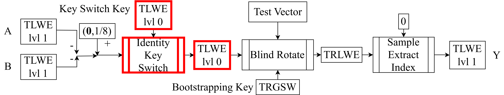

<!--
theme: default
size: 16:9
paginate: true
footer :  [licence](https://creativecommons.org/licenses/by-sa/4.0/)
style: |
  h1, h2, h3, h4, h5, header, footer {
        color: white;
    }
  section {
    background-color: #505050;
    color:white
  }
  table{
      color:black
  }
  code{
    color:black
  }
    a {
    font-weight:bold;
    color:#F00;
  }
-->

<!-- page_number: true -->

# Introduction to TFHE Implementation

## 5.Identity Key Switching

Kotaro Matsuoka

---

## Position of Explained Content in HomNAND



---

## What is Identity Key Switching

- "Key Switching" generally refers to changing the secret key without decrypting ciphertext
  - Generally, a [Lipschitz continuous](https://en.wikipedia.org/wiki/Lipschitz_continuity) function is applied simultaneously with changing the secret key
    - Mostly linear functions
- "Identity Key Switching" here is the operation of switching TLWElvl1 to TLWElvl0
  - lvl1 and lvl0 have different keys
  - "Identity" because the identity function is applied

---

## Idea of Identity Key Switching

- Here, we write the TLWElvl1 key as $\mathbf{S}$ (vector of $s[X]$ coefficients)
- Compute $b-\mathbf{a}⋅ \mathbf{S}$ of TLWElvl1 on ciphertext using TLWElvl0
- That is, let $(\mathbf{ã},b̃)$ be the output TLWElvl0 and satisfy the following
$b̃-\mathbf{ã}⋅\mathbf{s} ≈ b-\mathbf{a}⋅ \mathbf{S}$
  - This means making TLWElvl0 and plaintext match except for noise

---

## Naive Implementation of Identity Key Switching (Scaling Only)

- Although different from the paper, let's explain following the same flow as TRGSW
  - Actually, if $n$ is a power of 2, it can be done with ExternalProduct and SampleExtractIndex
    - Degree of freedom in parameter selection is significantly reduced (used in BFV and CKKS)
  - If you think of using TGSW instead of TRGSW, it's External Product itself
- $basebit∈\mathbb{Z}^+$ corresponds to $Bgbit$ in External Product
  - Scaling doesn't need to be a power of 2, but we assume it here for simplicity

---

- Let $\mathbf{KS}$ be such that $KS_{ij}$ is TLWElvl0 with plaintext $\frac{S_{ij}}{2^{basebit}}$
  - $i$ is vector dimension, $j$ is polynomial coefficient side
$(\mathbf{ã},b̃) = (\mathbf{0},b)-∑^{N-1}_{i=0}⌈2^{basebit}⋅a_i⌋⋅KS_i$
  - This homomorphically computes $b-\mathbf{a}⋅ \mathbf{S}$, but noise is too large

---

## Decomposition-like Radix Expansion in Identity Key Switching

- Same as TRGSW, scaling alone won't work, so we also do Decomposition
  - Let the number of digits be $t$ (corresponding to $l$)

```
IdentityKeySwitching((𝐚,b),𝐊𝐒)
  roundoffset = 1 << (32 - (1 + basebit * t)) //for rounding
  b̄=b
  𝐚̄ = 0⃗
  for i from 0 to t-1
    for j from 0 to kN - 1
      âᵢⱼ = ((aⱼ+roundoffset)>> (32 - (i+1)⋅basebit))&(2ᵇᵃˢᵉᵇⁱᵗ - 1)
  for i from t-1 to 0
    for j from 0 to kN-1
      if âᵢⱼ ≥ 2ᵇᵃˢᵉᵇⁱᵗ⁻¹
        âᵢⱼ -= 2ᵇᵃˢᵉᵇⁱᵗ
        â₍ᵢ₋₁₎ⱼ += 1
      (𝐚̄,b̄) -= âᵢⱼ ⋅ KSᵢⱼ
  return (𝐚̄,b̄)
```
---

## Specific Implementation of Identity Key Switching (Replace Multiplication with Element Selection)

- The previous slide's approach isn't bad
  - Unlike External Product, since it's a product with scalar integers, the values it can take are fairly limited
- Redefine $\mathbf{KS}$ so that $KS_{ijk}$ is TLWElvl0 with plaintext $\frac{k⋅S_i}{2^{(j+1)basebit}}$ ($k ∈ [1,2^{basebit-1}]$)
  - $\mathbf{KS}$ data size becomes $2^{basebit-1}$ times larger
  - Trade-off with reduced noise growth since multiplication is eliminated
- For the case $k=0$, no need to add, so no need to hold

---

## Specific Implementation of Identity Key Switching (Pseudocode)

```
IdentityKeySwitching((𝐚,b),𝐊𝐒)
  roundoffset = 1 << (32 - (1 + basebit * t)) //for rounding
  b̄=b
  𝐚̄ = 0⃗
  for i from 0 to t-1
    for j from 0 to kN - 1
      âᵢⱼ = ((aⱼ+roundoffset)>> (32 - (i+1)⋅basebit))&(2ᵇᵃˢᵉᵇⁱᵗ - 1)
  for i from t-1 to 0
    for j from 0 to kN-1
      if âᵢⱼ ≥ 2ᵇᵃˢᵉᵇⁱᵗ⁻¹
        âᵢⱼ -= 2ᵇᵃˢᵉᵇⁱᵗ
        â₍ᵢ₋₁₎ⱼ += 1
      k = abs(âᵢⱼ)
      if âᵢⱼ > 0
        (𝐚̄,b̄) -= KSᵢⱼₖ
      else if âᵢⱼ < 0
        (𝐚̄,b̄) += KSᵢⱼₖ
  return (𝐚̄,b̄)
```

---


## Identity Key Switching Parameters and Minimum Implementation

- $t = 5$, $basebit = 2$
- Identity Key Switching as explained here is the minimum

---

## Optimization Applicable to IKS

- Making part of the lvl1 key the lvl0 key simplifies computation
  - Since $n<kN$, make up to the $n$-th coefficient of $\mathbf{S}$ the lvl0 key
  - Just need to compute the difference with IKS
- This method is safe as far as no attack method has been found, but safety is unknown
