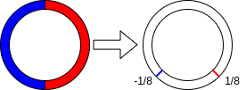

<!--
theme: default
size: 16:9
paginate: true
footer :  [licence](https://creativecommons.org/licenses/by-sa/4.0/)
style: |
  h1, h2, h3, h4, h5, header, footer {
        color: white;
    }
  section {
    background-color: #505050;
    color:white
  }
  table{
      color:black
  }
  code{
    color:black
  }
    a {
    font-weight:bold;
    color:#F00;
  }
-->

<!-- page_number: true -->

# Introduction to TFHE Implementation

## 6.HomNAND

Kotaro Matsuoka

---

## What is HomNAND

- Can compute NAND without decryption
- Can be created by combining what we've built so far


---

## Visual Image (Mapping by Blind Rotate)

- Figure also shown in Blind Rotate slide
  - Just need to bring what we want to map to 1 to the right half, and what we want to map to 0 to the left half



---

## Specific Construction of HomNAND

```
HomNAND((𝐚₀,b₀),(𝐚₁,b₁),𝐁𝐊,𝐊𝐒)
  tlwelvl0 = (0,μ)-(𝐚₀,b₀)-(𝐚₁,b₁)
  tlwelvl1 = GateBootstrappingTLWEtoTLWE(tlwelvl0,𝐁𝐊)
  return IdentityKeySwitch(tlwelvl1,𝐊𝐒)
```
---

## Other 2-Input Gates

- Let input ciphertexts be $ca,cb$
- Let ciphertext entering Blind Rotate be $scale⋅(ca+cb)+offset$
  - NOT just flips the sign

||AND|OR|XOR|
|---|---|---|---|
|$scale$|$1$|$1$|$2$|
|$offset$|$-\frac{1}{8}$|$\frac{1}{8}$|$\frac{1}{4}$|

---

## About MUX

- All 2-input gates can be made similarly to HomNAND
- For 3-input gates, only MUX can reduce computational cost by devising
- Let three inputs be $s,d1,d0$
- MUX is $(d1∧s)∨(d0∧\lnot s)$
- One of $(d1∧s)$ and $(d0∧\lnot s)$ is always zero
- Therefore, $∨$ can be replaced with vector addition on Torus
  - $(d1∧s)+(d2∧\lnot s)+(\mathbf{0},\frac{1}{8})$

---

## Minimum Implementation for HomNAND

- HomNAND itself
  - Good to make other gates too if you have capacity
- Can be almost made just by calling what we've explained so far in order
