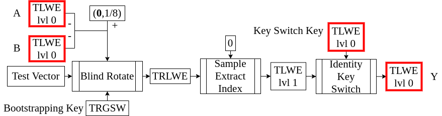
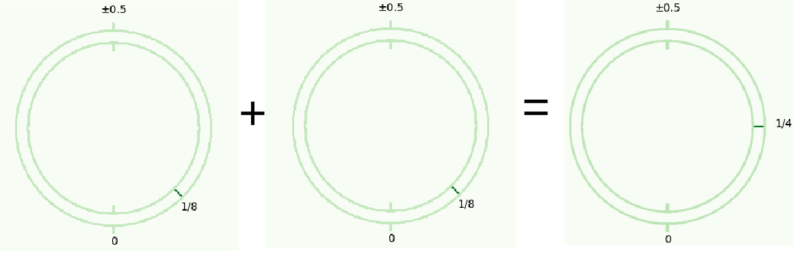

<!-- 
theme: default
size: 16:9
paginate: true
footer :  [licence](https://creativecommons.org/licenses/by-sa/4.0/)
style: |
  h1, h2, h3, h4, h5, header, footer {
        color: white;
    }
  section {
    background-color: #505050;
    color:white
  }
  table{
      color:black
  }
  code{
    color:black
  }
-->

<!-- page_number: true -->

# TFHE実装入門

## 1.TLWE

松岡　航太郎

---

## 説明内容のHomNANDでの位置づけ

- lvl1は次回説明するので今回はTLWEといえばlvl0のこと

---

## TLWEとは

- Torus Learning With Errorの略
- Torus版のLWE暗号という意味
- LWEについては簡単に後述

---

## Torusの直感的定義

- 日本語で言うと円周群のこと。$\mathbb{T}$とかく。
- 時計の針の角度をイメージすると良い
- 具体的な数字としては針の角度を2πで割ったもの

---

## Torusとは

- ここでは、$\mathbb{R} \bmod 1$を定義とする。つまり、実数の小数部分で、$[0,1)$または$[-0.5,0.5)$に値をとる
- 2つの値域のどちらを使うのが良いかは状況によって変わる
- 定義よりTorus同士の乗算は定義されないが、加算は定義できる
- 加算の例: $0.8+0.6=1.4≡0.4 \bmod 1,0.3-0.9=-0.6 ≡ 0.4 \bmod 1$
- 乗算が定義できないことを例で見る。$1.2≡0.2 \bmod 1,2.4≡0.4 \bmod 1$なので、乗算が定義できるなら$1.2⋅ 2.4=2.88≡0.2⋅0.4=0.08\bmod 1$だが成立しない。
- 整数($\mathbb{Z}$)との乗算は定義できる例$3⋅ 0.4≡ 0.2 \bmod 1$

---

## モジュラー正規分布

- TFHEの原論文だとModular Gaussian Distribution。
- 通常の正規分布のサンプルは実数($\mathbb{R}$)に値をとるが、TLWEではTorusに値をとる
- 正規分布のサンプルを$\bmod 1$したものがモジュラー正規分布

---

## TLWEの具体的構成(平文がTorusな場合)

- $\mathbb{B}=\{0,1\}$で、バイナリの値の集合。$\mathbb{B}⊂ \mathbb{Z}$
- 暗号の安全性を決めるパラメータは２つで$n∈\mathbb{Z}^+,α∈\mathbb{R}^+$
- $U_{\mathbb{T}^n}$を$\mathbb{T}$から$n$個の値を独立にとる一様分布とする
- $\mathcal{D}_{\mathbb{T},α}$を平均$0$標準偏差$α$のモジュラー正規分布とする
- $\mathbf{a}∈ \mathbb{T}^n, e,b∈ \mathbb{T}, \mathbf{s}∈ \mathbb{B}^n,m∈ \mathbb{T}$とする
- $m$が平文、$\mathbf{a}←U_{\mathbb{T}^n}$,$e←\mathcal{D}_{\mathbb{T},α}$,$\mathbf{s}←U_{\mathbb{B}^n}$とする
- TLWEの暗号文は$b=\mathbf{a}⋅ \mathbf{s}+ m +e$として、$(\mathbf{a},b)$というn+1要素のベクトルである
- $b-\mathbf{a}⋅\mathbf{s}=m+e$になるので、この$e$をどうにかして削除する方法を加えると$m$がとれて復号できる
- $n,α$を大きくすればするほど安全($α$は大きくしすぎると暗号文が壊れる)

---

## LWEとは

- 名前にあるとおり、Errorが重要な役割を果たす
- mがわかっている暗号文が好きなだけ手に入るとき(IND-CPA)Errorがないと、手に入った暗号文の$\mathbf{a}$を並べた行列の逆行列を計算すれば秘密鍵がわかってしまう
- Errorがあると単純な逆行列の問題からずれ、Errorが大きいほど難しくなる
- 行列のサイズが大きい程難しいともいえるので$n$も安全性に寄与する
- LWEへの具体的攻撃法は「格子暗号解読のための数学的基礎」がよい

---

## Visual Image(暗号化によるノイズ)

|平文|ノイズを加えた場合|
|---|---|
|||

- 強調して書いてはいるが、復号が誤る確率は0ではない(実用的には無視できる)

---

## Torusの加法準同型性

- ２つの暗号文$(\mathbf{a}_1,b_1),(\mathbf{a}_2,b_2)$を考え、その和を$(\mathbf{a}_1+\mathbf{a}_2,b_1+b_2)$とする
- $b_1+b_2-(\mathbf{a}_1+\mathbf{a}_2)⋅\mathbf{s}=m_1+m_2+e_1+e_2$になり、$m_1+m_2$が出てくるので加法準同型になっていることが分かる
- 誤差も$e_1+e_2$となっているので、足し算ができる回数には限界がある
- 誤差が大きすぎると復号を誤る確率が大きくなる

---

## TLWEの具体的構成(平文がバイナリな場合)

- $m∈ \mathbb{B},μ=1/8\in\mathbb{T}$とする。
- $μ(2⋅ m-1)∈\mathbb{T}$である
- TLWEの暗号文は$b=\mathbf{a}⋅ \mathbf{s}+μ(2⋅ m-1)+e$
- 復号は$(1+\mathit{sgn}(b-\mathbf{a}\cdot\mathbf{s}))/2$である。($\mathit{sgn}$は符号関数)
- 復号のときには$\mathbb{T}=[-0.5,0.5)$になっている

---

## Visual Image(ノイズ無しでの加算)

---

## Visual Image(ノイズありでの加算)

---

## Torusの実装法

- 実数の小数部の集合なので、素直に考えると倍精度浮動小数点数で実装したくなる
- ただ、倍精度浮動小数点数で$\bmod 1$の計算をするのは重い
- そこで、小数点が最上位bitの前にあるような固定少数点数を用いることにする
- 例:8bit幅の場合、$0.5$は$0b1000000$、$0.375$は$0b01100000$になる
- この方法だと加算や乗算で出た整数部分はオーバーフローで捨てられるので剰余演算が要らない
- 例:8bit幅の場合、$0.5+0.625 \bmod 1=0b1000000+0b10100000=0b0010000=0.125 \bmod 1$
- 固定小数点数の幅は$e$が十分に表現できる程度の幅であれば良い
- つまりモジュラー正規分布の分散によって十分な幅が決まる

---

## 実数とトーラスの変換の実装

- モジュラー正規分布の実装には実数とTorusの変換が必要
- 理想的には実数の小数部分を取り出す操作
- 実数の整数部を取り出す操作を$\mathrm{int}()$、固定小数点の幅を$w$、入力となる実数を$d$とする
- 実数の小数部分を取り出すだけなら、$d \mod{1}$でよい
- 実際には固定幅の固定小数点にしたいので、実数の上から$w$桁の部分を整数として取り出す
- 実装したい操作を数式で書くと以下のようになる
$$
\mathrm{int}((d \mod{1})⋅2^w)
$$

---

## TLWEのパラメータについて

- この講義ではパラメータ128bit securityと現在推定されている値を紹介する
- $n=630$,$α=2^{-15}$、固定小数点の幅は32bit
- TLWEの安全性はLWEの安全性の問題に帰着されるので、LWE用の推定方法がつかえる
- LWE Estimatorがデファクトスタンダード(https://bitbucket.org/malb/lwe-estimator/src/master/)
- 推定のコードはここ(https://tfhe.github.io/tfhe/security_and_params.html)

---

## 乱数生成について

- 暗号の安全性は乱数の質に大きく左右される
- メルセンヌ・ツイスタを用いてはいけない(ポケモンの乱数調整)
- 原論文著者実装では使っているが真似してはいけない
- 一番安全なのはOSが提供する乱数を使うこと(Linuxなら/dev/urandom)
- 暗号学的に安全性が担保された疑似乱数をCSPRNGという
- Cryptographically Secure PseudoRandom Number Generator の略
- TFHEppでは[Randen](https://github.com/google/randen)を使っている

---

## TLWEで最低限実装するもの

- HomNANDを作るのに必要なだけを挙げるのでより汎用的に作るかどうかは設計思想に任せる
- 平文をバイナリに限定した場合の暗号化と復号さえ実装できればいい
- 暗号文同士の加算は後で使うので、ベクトルっぽい加算がしやすいようにデータを保持しておくと良い
- パラメータは後で簡単に変更できるように書いておいた方が汎用性は高い
