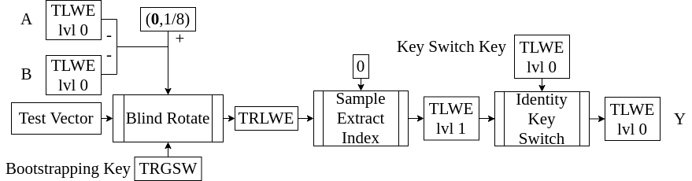

<!-- 
theme: default
size: 16:9
paginate: true
footer :  [licence](https://creativecommons.org/licenses/by-sa/4.0/)
style: |
  h1, h2, h3, h4, h5, header, footer {
        color: white;
    }
  section {
    background-color: #505050;
    color:white
  }
  table{
      color:black
  }
  code{
    color:black
  }
    a {
    font-weight:bold;
    color:#F00;
  } 
-->

<!-- page_number: true -->

# TFHE実装入門

## 6.HomNAND

松岡　航太郎

---

## HomNANDとは

- 復号をせずにNANDを演算することができる
- 今まで作ってきたものを組み合わせれば作ることができる



---

## Visual Image(Blind Rotateによる写像)

- Blind Rotateのスライドでも載せた図
  - 1に写したいものを右半面に0に写したいものを左半面に持ってくればいい


---

## Visual Image(ノイズ無しでの加算の全パターン)

- $(\mathbf{0},1/8)$から入力２つの和を引くと両方が1のときだけ左半面にあることになる
- 両方が1のときだけ0になるのはまさしくNAND
  - 最初の加減算の符号と定数の値はこうやって決められている
  - 他の２入力の論理ゲートも同じように選ぶことで作ることができる


---

## HomNANDの具体的構成

```
HomNAND((𝐚₀,b₀),(𝐚₁,b₁),𝐁𝐊,𝐊𝐒)
  tlwelvl0 = (0,μ)-(𝐚₀,b₀)-(𝐚₁,b₁)
  tlwelvl1 = GateBootstrappingTLWEtoTLWE(tlwelvl0,𝐁𝐊)
  return IdentityKeySwitch(tlwelvl1,𝐊𝐒)
```

---

## HomNANDで最低限実装するべきもの

- HomNANDそのもの
- 今まで説明してきたものを順番に呼び出すだけでほぼ作れる

---

## 他の２入力ゲート

- 入力の暗号文を$ca,cb$とする
- Blind Rotateに入る暗号文を$scale⋅(ca+cb)+offset$とする
  - NOTは符号反転するだけ

||AND|OR|XOR|
|---|---|---|---|
|$scale$|$1$|$1$|$2$|
|$offset$|$-\frac{1}{8}$|$\frac{1}{8}$|$-\frac{1}{4}$|


---

## MUXについて

- 2入力ゲートはすべてHomNANDと同じように作れる
- 3入力ゲートはMUXだけ工夫によって計算量が減らせる
- 3つの入力を$s,d1,d2$とする
- MUXは$(d1∧s)∨(d2∧\lnot d2)$
- $(d1∧s)$と$(d2∧\lnot d2)$のいずれかは必ずゼロ
- そのため、$∨$をトーラスのベクトルの足し算に置き換えられる