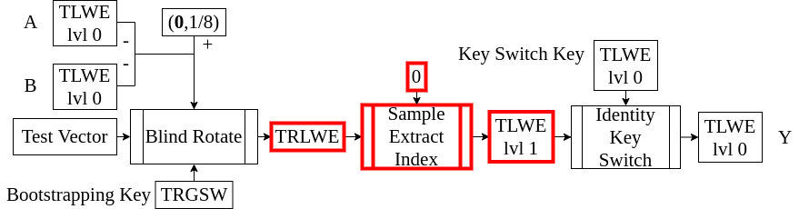

<!-- 
theme: default
size: 16:9
paginate: true
footer :  [licence](https://creativecommons.org/licenses/by-sa/4.0/)
style: |
  h1, h2, h3, h4, h5, header, footer {
        color: white;
    }
  section {
    background-color: #505050;
    color:white
  }
  table{
      color:black
  }
  code{
    color:black
  }
    a {
    font-weight:bold;
    color:#F00;
  } 
-->

<!-- page_number: true -->

# TFHE実装入門

## 2.TRLWE & SampleExtarctIndex

松岡　航太郎

---

## 説明内容のHomNANDでの位置づけ



---

## TRLWEとは

- Torus Ring-LWEの略
- TLWEは平文がスカラーだったが、TRLWEでは多項式になる
- Ringは多項式『環』の上で定義することから来ている
  - 課題でやってもらった多項式の剰余演算が出てくる

---

## 多項式環

- $N∈\mathbb{Z}^+$とする
- TRLWEで使う多項式環はTorusを係数とする多項式を$X^N+1$で割った余りが成す剰余環である
- この多項式環を$\mathbb{T}_N[X]$と表記する
- Torus同士の乗算は定義できないので当然$\mathbb{T}_N[X]$の元同士の積は定義できない
- 整数とTorusの乗算は定義できるので、$\mathbb{Z}_N[X]$の元との積は定義できる

---

## 多項式環上の乗算

- この処理がTFHEで一番重い処理なので高速化したいならここを高速化すべき
  - FFT(高速フーリエ変換)かNTT(数論変換)を使って実装するのが知る限り最速
- ここではナイーブな実装を扱う(知る限り最適な実装は7章で扱う)
- 普通に２つの元を掛け算したあと、剰余を取って、係数の小数部に相当する部分を抜き出せば良い
- 入力を$a[X]∈\mathbb{T}_N[X],b[X]∈\mathbb{Z}_N[X]$とする
- $a[X]=\sum_{i=0}^{N-1}a_iX^i,a_i∈\mathbb{T}$である

```
for i from 0 to N-1
  cᵢ = 0
for i from 0 to N-1
  for j from 0 to N-1
    if i+j<N
      cᵢ₊ⱼ += aᵢ⋅bⱼ
    else
      cᵢ₊ⱼ₋ₙ -= aᵢ⋅bⱼ (Nの下付きが打てないのでₙになっている)
```

---

## TRLWEの具体的構成(平文が$\mathbb{T}_N[X]$の場合)

- 暗号の安全性を決めるパラメータは3つで$N,k∈\mathbb{Z}^+,α_{bk} \in \mathbb{R}^+$
  - 厳密には$k=1$の場合のみがTRLWEで$k>1$の場合はTMRLWEと呼ぶべきか
    - 現時点では名称は定まっていないのでここでは一緒くたにTRLWEとする
- $\mathbf{a}[X] ∈ (\mathbb{T}_N[X])^k,b[X],m[X],e[X] \in \mathbb{T}_N[X], \mathbf{s}[X] \in (\mathbb{B}_N[X])^k$とする
- $m[X]$が平文、$\mathbf{a}[X]←U_{(\mathbb{T}_N[X])^k}$,$e[X]←\mathcal{D}_{\mathbb{T}_N[X],α_{bk}}$,$\mathbf{s}[X]←U_{\mathbb{B}_N[X]}$とする
- TRLWEの暗号文は$b[X]=\mathbf{a}[X]⋅ \mathbf{s}[X]+ m[X] +e[X]$として、$(\mathbf{a}[X],b[X])$という$N-1$次の多項式$k+1$要素のベクトルである
- $b[X]-\mathbf{a}[X]⋅\mathbf{s}[X]=m[X]+e[X]$になるので、この$e[X]$をどうにかして削除する方法を加えると$m[X]$がとれて復号できる
- $N,k,α_{bk}$を大きくすればするほど安全($α_{bk}$は大きくしすぎると暗号文が壊れる)
- 同じ安全性、同じデータならTLWEよりTRLWEの方がサイズが小さい(と信じられている)

---

## TRLWEの加法準同型性

- TLWEとTRLWEはよく似ているので加法準同型性も同じように成り立つ
- ２つの暗号文$(\mathbf{a}[X]_1,b[X]_1),(\mathbf{a}[X]_2,b[X]_2)$を考える
- その和を$(\mathbf{a}[X]_1+\mathbf{a}[X]_2,b[X]_1+b[X]_2)$とする
- $b_1[X]+b_2[X]-(a_1[X]+a_2[X])⋅s[X]=m_1[X]+m_2[X]+e_1[X]+e_2[X]$になり、$m_1[X]+m_2[X]$が出てくるので加法準同型になっている
- TLWEよりサイズが小さいのでより高速に加算ができることになる(SIMDライク)

---

## TRLWEの具体的構成(平文が$\mathbb{B}_N[X]$の場合)

- これもTLWEと似た形
- $m[X] \in \mathbb{B}[X],μ=1/8 \in\mathbb{T}$とする
- $(μ(2⋅ m[X]-1[X])∈\mathbb{T}_N[X])$である
- TRLWEの暗号文は$b[X]=\mathbf{a}[X]⋅ \mathbf{s}[X]+μ(2⋅ m[X]-1[X])+e[X]$
- 復号は$(1+\mathit{sgn}(b[X]-\mathbf{a}[X]⋅ \mathbf{s}[X]))/2$($\mathit{sgn}$は符号関数で各係数に作用)

---

## SampleExtractIndex

- TRLWEを$N$個のTLWEに分解する操作
- 平文に対しての操作で言うと、多項式の係数を取り出す操作に相当する
- 1.で話したTLWEは$\mathbf{a}$の要素は$n$個だがここでは$kN$個
  - 区別が必要なときは前のをTLWElvl0、今のをTLWElvl1と以降呼ぶ
- 鍵も2本あることに注意
- TLWEが破れるならTRLWEが破れることを意味するので安全性の意味でも大事

---

## SampleExtractIndexの具体的構成(数式表現)

- 基本的には復号の一部をぐっと睨むと出てくるので表現を変えてみてみる
$$b[X]-\mathbf{a}[X]⋅ \mathbf{s}[X]=∑^{N-1}_{x=0} [b_x-(∑_{i+j=x,0≤i,j≤N-1}a_i⋅s_j)-(∑_{i+j=N+x,0≤i,j≤N-1}-a_i⋅s_j)]X^x$$
- 3つ目の$\sum$で中の掛け算にマイナスがついてるのは剰余環の上の演算だから
- 基本的な発想は$x$を一つの値に固定すること
- そうすると平文の多項式の$x$項を表現するTLWEが以下のようになることが分かる

$$
\begin{aligned}
b'&=b_x\\
j\in[0,k)
a'_{ji}&=\begin{cases}
a_{j(x-i)}\ \mathrm{if}\ i≤x\\
-a_{j(N+x-i)}\ \mathrm{otherwise}
\end{cases}
\end{aligned}
$$

---

## SampleExtractIndexの具体的構成(疑似コード表現)

```
SampleExtractIndex((a[X],b[X]),x)
  b̄ = bₓ
  𝐚̄ = 0
  for j from 0 to k-1
    for i from 0 to x
      āⱼᵢ = aⱼ₍ₖ₋ᵢ₎
    for i from x+1 to N-1
      āⱼᵢ = -aⱼ₍ₙ₊ₓ₋ᵢ₎ //下付きにできないのでNが小文字になっている
  return (𝐚̄,b̄)
```

---

## TRLWEのパラメータについて

- $N=1024,k=2,α_{bk}=2^{-25}$
- 実はTRLWEの安全性を直接推定する方法は知られていない
  - TRLWEに入っている環の構造を利用した攻撃が知られていないため
  - 安全性の推定はTLWEに変換して行われている(十分条件による弱い推定)

---

## なぜ$X^N+1$なのか

- 実のところ$X^N+1$でなければならないわけではない
- しかし因数分解できてしまうと$N$が小さなTRLWEに分解できてしまって脆弱
- $X^N+1$は$N$が2のべきなら因数分解できない
  - [円分多項式](https://ja.wikipedia.org/wiki/%E5%86%86%E5%88%86%E5%A4%9A%E9%A0%85%E5%BC%8F)の一種
- 非ゼロの項も2つしかないので剰余がとりやすい
- 7.で見るようにFFTによる高速化ができるのも利点

---

## TRLWEで最低限実装すべきもの

- 暗号化と復号は平文をバイナリ係数多項式に限定した場合だけできればよい
- SampleExtractIndexは$x=0$の場合しか使わない
- 暗号文同士の加算は後で使うので、ベクトルっぽい加算がしやすいようにデータを保持しておくと良い
- パラメータは後で簡単に変更できるように書いておいた方が汎用性は高い

---

## 参考文献

- [$X^N+1$である理由](https://eprint.iacr.org/2012/235)
