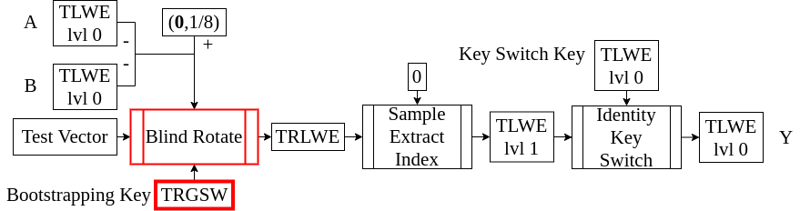
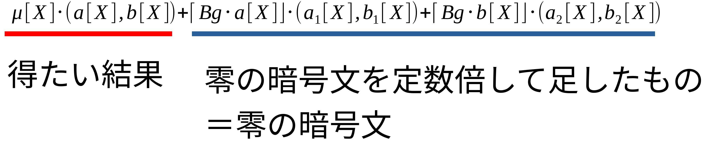

<!-- 
theme: default
size: 16:9
paginate: true
footer :  [licence](https://creativecommons.org/licenses/by-sa/4.0/)
style: |
  h1, h2, h3, h4, h5, header, footer {
        color: white;
    }
  section {
    background-color: #505050;
    color:white
  }
  table{
      color:black
  }
  code{
    color:black
  }
    a {
    font-weight:bold;
    color:#F00;
  } 
-->

<!-- page_number: true -->

# TFHE実装入門

## 3.TRGSW & CMUX

松岡　航太郎

---

## 説明内容のHomNANDでの位置づけ

- CMUXは次回説明するBlind Rotateで中心的役割を果たす



---

## TRGSWとは

- Torus Ring-GSWの略
- GSWは考案者のCraig Gentry, Amit Sahai, and Brent Watersの頭文字を取ったもの
- GSWは完全準同型暗号の一種で、それをTorus係数多項式に拡張したのがTRGSW
- TRGSWを理解することがTFHEを理解する上で特に重要

---

## 整数多項式対角行列とTRLWEの積

- いきなりTRGSWの具体的構成をみてもモチベーションがわからない
- TRGSWを使ってやりたい演算を構成していくことでTRGSWを導出する
- 以下のような演算を復号せずにやりたい(準同型暗号上の多項式乗算)
  - 加法ができることは既に見ている
- この行列の部分をどうにかして暗号文にしたのがTRGSW

$\begin{aligned}
μ[X]&∈\mathbb{Z}_N[X]\\
μ[X]⋅(a[X],b[X])&=(a[X],b[X])⋅
\left(
    \begin{array}{cc}
      μ[X] & 0 \\
      0 & μ[X]
    \end{array}
  \right)
\end{aligned}$

---

## スケーリング

- TRGSWの構成には３つ重要なアイデアがあり、１つがスケーリング
- TFHEで考える暗号文は整数係数多項式をそのまま平文にすることはできない
- 行列の方をTorus係数にしてその分をTRLWEに押し付けて整数係数に丸める
  - 丸めの分だけノイズが増えることに注意
- $Bg\in\mathbb{Z},Bg>μ[X],e_r[X]∈\mathbb{T}_N[X]$
- $e_r[X]$は丸めによるノイズ
- ノイズが$μ[X]$倍されることに留意
$\begin{aligned}
⌈Bg⋅(a[X],b[X])⌋⋅
\left(
    \begin{array}{cc}
      \frac{μ[X]}{Bg} & 0 \\
      0 & \frac{μ[X]}{Bg}
    \end{array}
  \right)&=(a_r[X],b_r[X])\\
  &≈μ[X]⋅(a[X],b[X])\\
  b_r[X]-a_r[X]⋅s[X] = μ[X](b[X] - &a[X]⋅s[X]+e_r[X])
\end{aligned}$

---

## 零行列加算

- 行列に0を暗号化したTRLWEを加算することで行列を隠す(暗号文でマスクする)
  - 足した後の行列はTRLWEのベクトルとして解釈できる
- $(a_1[X],b_1[X]),(a_2[X],b_2[X])$は0を暗号化したTRLWE
- つまり、$b_1[X]-a_1[X]⋅s[X]=0+e_1[X]$
  - 0の暗号文を定数倍し足しても0の暗号
  - ノイズが増えるだけで結果の平文は前と同じ

$
⌈Bg⋅(a[X],b[X])⌋⋅[
\left(
    \begin{array}{cc}
      \frac{μ[X]}{Bg} & 0 \\
      0 & \frac{μ[X]}{Bg}
    \end{array}
  \right)+
  \left(
    \begin{array}{cc}
      a_1[X] & b_1[X] \\
      a_2[X] & b_2[X]
    \end{array}
  \right)]\\
  ≈μ[X]⋅(a[X],b[X])+⌈Bg⋅a[X]⌋⋅(a_1[X],b_1[X])+⌈Bg⋅b[X]⌋⋅(a_2[X],b_2[X])
$

---

## 何をしているか



---

## $Bg$に関するトレードオフ

- $⌈Bg⋅a[X]⌋,⌈Bg⋅b[X]⌋$の係数の最大値は$Bg$
- つまり$Bg$を大きくすると0の暗号文由来のノイズが大きく影響する
- しかし$Bg$を小さくすると丸めによるノイズが大きくなる
- このトレードオフから逃れるのがDecomposition

---

## Decomposition(一般的定義)

- TRLWEを丸めるときに$Bg$を基数とみなして$l$桁に分解する
  - $Bg$を大きくせずに丸めによるノイズを減らせる
- Decompositionは多項式$a[x]∈T_N[X]$を入力にとる
- 出力として多項式のベクトル$\mathbf{ā}[X]∈(\mathbb{Z}_N[X])^l$を返す
  - 要素となる多項式の係数は入力となる多項式の係数の一桁を抜き出したもの
  - Torusを$Bg$進表現したときの１番上の桁を集めたもの、次の桁という具合でベクトルの要素は並ぶ
- $ā_{ij}$は$\mathop{\rm arg~min}\limits_{ā_{ij}} ∑^{N-1}_{j=0}(a_j-∑_{i=1}^{l}\frac{ā_{ij}}{Bg^i})^2\ s.t.\ ā_{ij}∈[-\frac{Bg}{2},\frac{Bg}{2})$を満たすとする
  - $[0,Bg)$でなく$[-\frac{Bg}{2},\frac{Bg}{2})$にとるのはノイズを小さくしたいから
- $ā_i[X]$を$0≤j≤N-1$次の係数が$ā_{ij}$である多項式とする
- 多項式のベクトル$\mathbf{ā}[X]$の$1≤i≤l$番目の要素を$ā_i[X]$として返す
---

## Decompositionでつくるもの

- 逆操作を先に見ることでイメージを得よう
- $⌈Bg⋅(a[X],b[X])⌋$は$l=1$の場合のDecompositionになっている

$
(a[X],b[X])≈ (ā_1[X],...,ā_l[X],b̄_1[X],...,b̄_l[X])
\left(
    \begin{array}{cc}
      \frac{1}{Bg} & 0 \\
      \frac{1}{Bg^2} & 0 \\
      ⋮ & ⋮\\
      \frac{1}{Bg^l} & 0 \\
      0 & \frac{1}{Bg}\\
      0 & \frac{1}{Bg^2}\\
      ⋮&⋮\\
      0 & \frac{1}{Bg^l}\\
    \end{array}
\right)
$

---

## Decomposition(具体的構成)

- $ā_i[X]$を具体的に与えるアルゴリズムを示していく
  - 簡単のため$Bg=2^{Bgbit}$と書ける場合に限定する
  - Torusはuint32_tで表現されているものとする
- $[-\frac{Bg}{2},\frac{Bg}{2})$だと係数が負になる場合を考える必要がある
- 各桁に$\frac{Bg}{2}$をたすことで$[0,Bg)$にずらす
- こうするとbitマスクで取り出すだけで良くなる
- 最後に各係数から$\frac{Bg}{2}$を引いて元に戻す

---

## Decomposition(基本的アイデア)

- 前提としてもし各桁を$[0,Bg)$の範囲で取るならmaskだけで良い
  - $[0,Bg)$にとる場合を$â$とする
  - つまり$â_{ij}=(((aᵢ+2^{32-Bgbit⋅l-1})>>(32-Bgbit⋅i))\&(Bg-1))$
  - $2^{32-Bgbit⋅l-1}$は四捨五入のための定数
  - これは$\mathop{\rm arg~min}\limits_{\hat{a}_{ij}} ∑^{N-1}_{j=0}(a_j-∑_{i=1}^{l}\frac{\hat{a}_{ij}}{Bg^i})^2\ s.t.\ \hat{a}_{ij}\in[0,Bg)$を満たす
- $a[X]から\mathbf{â}[X]$を経由した$\mathbf{ā}[X]$への変換を考える
  - 以下のような関係が成り立つように$ā_{ij}$を決めることができる(要は桁上がりをしている)
$$
â_{ij} = \begin{cases} Bg+ā_{ij}\qquad if\quad â_{ij}≥\frac{Bg}{2}\\ ā_{ij}\qquad otherwise\end{cases}
$$

---

## Decomposition(疑似コード)

- このアイデアをナイーブに実装した場合の疑似コードを示そう
  - やっていることはほぼ繰り上がり計算なので加算機にそれを任せる最適化が可能だが複雑になりすぎるのでここでは説明しない
  - Torusは32bit固定小数点表現されていることを仮定している

```
Decomposition(a[X])
  roundoffset = 1 << (32 - l * Bgbit - 1)
  for i from 1 to l
    for j from 0 to N-1
      âᵢⱼ=(((aⱼ+roundoffset)>>(32-Bgbit*i))&(Bg-1))
  for i from l to 1
    for j from 0 to N-1
      if âᵢⱼ ≥ Bg/2
        āᵢⱼ = âᵢⱼ - Bg
        â₍ᵢ₋₁₎ⱼ += 1
      else
        āᵢⱼ = âᵢⱼ
  return 𝐚̄[X]
```
---

## TRGSWの具体的構成(平文が$\mathbb{Z}_N[X]$の場合)

- DecompostionをTRLWEに施したのと掛け算をすると考えると暗号文はこうなる
  - 実際は平文空間は$\mathbb{B}$だけでもHomNANDはつくれる
$
\left(
    \begin{array}{cc}
      \frac{μ[X]}{Bg} & 0 \\
      \frac{μ[X]}{Bg^2} & 0 \\
      ⋮ & ⋮\\
      \frac{μ[X]}{Bg^l} & 0 \\
      0 & \frac{μ[X]}{Bg}\\
      0 & \frac{μ[X]}{Bg^2}\\
      ⋮&⋮\\
      0 & \frac{μ[X]}{Bg^l}\\
    \end{array}
\right)+
\left(
    \begin{array}{cc}
      a_1[X] & b_1[X] \\
      a_2[X] & b_2[X] \\
      ⋮ & ⋮\\
      a_l[X] & b_l[X] \\
      a_{l+1}[X] & b_{l+1}[X]\\
      a_{l+2}[X] & b_{l+2}[X]\\
      ⋮&⋮\\
      a_{2l}[X] & b_{2l}[X]\\
    \end{array}
\right)
$

---

## External Product

- TRLWEとTRGSWの積のこと
- TRGSWを$\mathbf{C}$とする
- ちなみにInternal ProductはTRGSW同士の積を指すが使わないので省略
$
\mathbf{C}⊡ (a[X],b[X]):=(\mathrm{Decomposition}(a[X]),\mathrm{Decomposition}(b[X]))⋅\mathbf{C}
$

---

## $l$に関するトレードオフ

- $l$を増やせば丸めのノイズを減らすことができる
- $l$を増やすと0の暗号文由来のノイズが増える
- $l$は丸めには指数で効き0の暗号文由来には線形で効く
- $l$を増やすほどExternal Productの多項式乗算が増えて重くなる
- トレードオフの出方が$Bg$と違う

---

## CMUX

- Controlled MUXの略らしい
- External Productを使うことで、マルチプレクサを作ることができる
  - TRGSWの平文空間を$\mathbb{B}$とする
  - TRGSWの平文が0なら$(a_0[X],b_0[X])$、1なら$(a_1[X],b_1[X])$が選ばれる
- CMUXをするたびにノイズが増えるので回数には制限がある
- これだけでもWeighted Finite Automataが作れたりするが省略

$\mathbf{C}⊡ [(a_1[X],b_1[X])-(a_0[X],b_0[X])]+(a_0[X],b_0[X])$

---

## TRGSWのパラメータについて

- $Bgbit=6,Bg=64,l=3$
- TRGSWの行ごとの平文に相関があることを利用した攻撃は知られていない
- 現状の安全性は行毎のTRLWEの安全性で評価されている
  - 結局Integer LWEに落ちる

---

## TRGSWで最低限実装すべきもの

- 平文を$\mathbb{B}$としたTRGSWの暗号化(復号は必要ない)
- External Product
- CMUX
