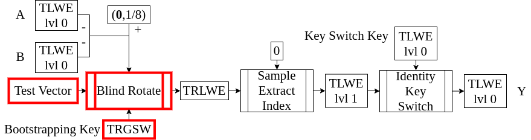

<!-- 
theme: default
size: 16:9
paginate: true
footer :  [licence](https://creativecommons.org/licenses/by-sa/4.0/)
style: |
  h1, h2, h3, h4, h5, header, footer {
        color: white;
    }
  section {
    background-color: #505050;
    color:white
  }
  table{
      color:black
  }
  code{
    color:black
  }
    a {
    font-weight:bold;
    color:#F00;
  } 
-->

<!-- page_number: true -->

# TFHE実装入門

## 4.Blind Rotate

松岡　航太郎

---

## 説明内容のHomNANDでの位置づけ



---

## Blind Rotateとは

- 多項式(TRLWE)を"回転"させる準同型演算
  - "回転"とは要は$X$のべき乗をかけるということ
  - べき乗の指数はTLWElvl0によって決まる
- 入力としてTRLWEとTLWElvl0を1つずつの他に$n$個のTRGSWをとる
  - 入力となるTRLWEは特別にTest Vectorと呼ぶ
  - この$n$個のTRGSWはlvl0の秘密鍵を1bitずつ暗号化したものでBootstrapping Keyと呼ぶ
- Test Vectorをうまく選ぶことでTLWElvl0からTRLWEへの関数を作れる
  - Sample Extract Indexも合わせればTLWElvl0からTLWElvl1への関数が作れる
  - ∵Blind RotateによってTLWElvl0の値に応じてTRLWEの係数の位置と符号が変化するので、Sample Extract Indexで取り出す値が変わる

---

## TLWEの丸め

- べき乗の指数は整数でないと困るのでTLWEを丸める必要がある
  - 指数として意味がある範囲は$[0,2N)$
    - ∵$X^{2N}⋅a[X]≡a[X] \mod{X^{N}+1}$
  - ∴TLWEを$2N$倍して各係数を$[0,2N)$に丸めると意味のある数値がとれそう
- $X^{2N}$で元に戻るので、丸めた値は$2N$を法とする剰余環上の値とみなせる
- $⌊2N⋅(b-\mathbf{a}⋅\mathbf{s})⌋\mod{2N}$を使いたいが秘密鍵は漏らせない
  - 床関数なのは、$0$に丸まる値を$[0,1/2N)$にするため
  - $⌊2N⋅(b-\mathbf{a}⋅\mathbf{s})⌋\mod{2N}≈⌊2N⋅b⌋-∑_{i=0}^{n-1}⌈2N⋅a_i⌋⋅s_i \mod{2N}=ρ$
  - $⌈2N⋅a_i⌋$は計算可能なので$s_i$との積が計算できれば$ρ$は計算可能/
 図は$N=4$の場合の例

---

## Blind Rotateのアイデア

- 実現したい演算は与えられたTRLWEを$X^{-\rho}$倍すること
  - 負符号がついているのはその方が綺麗というだけ
- 秘密鍵を教えずに$⌈2N⋅a_i⌋⋅s_i$を計算したい
  - TRGSWに秘密鍵を暗号化し(Bootstrapping Key)CMUXで各bitが1か0かを反映

---

## Blind Rotateの具体的アルゴリズム

- $N=2^{Nbit}$とする(この講義のパラメータでは$Nbit=10$)
```
BlindRotaete((𝐚,b),𝐁𝐊,(𝐚[X],b[X]))
  b̃= b >> (32-Nbit-1)) //ここはfloor
  trlwe = X⁻ᵇ̃⋅(𝐚[X],b[X])
  for i from 0 to n-1
    ã=(aᵢ + (1<<(31-Nbit-1)) ) >> (32-Nbit-1) //足し算は四捨五入をするため
    trlwe = CMUX(𝐁𝐊ᵢ,Xᵃ̃⋅trlwe,trlwe)//Dec(𝐁𝐊ᵢ)?Xᵃ̃⋅trlwe:trlwe
  return trlwe
```
---

## GateBootstrapping TLWE to TLWE(概略)

- 平分の全ての係数が$1/8$であるようなTRLWEを入力としたBlind Rotateを行い、その出力の定数項をSample Extract Indexで取り出す操作の名前
  - $ρ∈[0,N)$のとき$1/8$、$[N,2N)$のとき$-1/8$が定数項に来る
  - これはある種の符号関数(暗号文の復号そのもの)
- 出力となるTLWElvl1のノイズはTLWElvl0のノイズにかかわらず一定になる
  - ∵TLWElvl1のノイズは$n$回のCMUXによるノイズのみで固定(Bootstrapping)
  - あとはTLWElvl1からTLWElvl0に変換しないといけないが、その方法は次回
 
---

## 自明な暗号文

- $[0,N)$で$1/8$を、$[N,2N)$で$-1/8$を取り出せるようなTRLWE(Test Vector)は平文の係数が全て$1/8$であるような暗号文
  - これを普通に暗号化して送ると平文がわかっている暗号文を送ってしまうことになるし、無駄にノイズも増える
- 実は$b[X]$を平文のTorus係数多項式そのままとし$\mathbf{a}[X]$を$\mathbf{0}$としても有効な暗号文
  - 秘密鍵も乱数生成器もなしで生成できる暗号文なので自明な暗号文と呼ぶ
  - もちろん情報を守ることはできないので使いどころは限られる

---

## GateBootstrapping TLWE to TLWE(疑似コード)

```
GateBootstrappingTLWEtoTLWE((𝐚,b),𝐁𝐊)
  testvec = (0,0)
  for i from 0 to N-1
    testvec += (0,μXⁱ)
  trlwe = BlindRotate((𝐚,b),𝐁𝐊,testvec)
  return SampleExtractIndex(trlwe,0)
```

---

## なぜlvl0とlvl1が必要なのか

- 原理的にはlvl1だけで構成することは可能
- $n$はBlindRotateでのCMUXの個数なのでこれを減らしたい
- BlindRotateではTorusを$[0,2N)$に丸める
  - この丸め誤差が$n+1$個入るがこれは一般に暗号文のノイズに比して大きい
  - Bootstrappingの誤り確率を抑えるために$n$を小さくしたい

---

## Blind Rotateで最低限実装するべきもの

- GateBootstrapping TLWE to TLWE
  - 任意のTRLWEをとるBlind Rotateを実装する必要はない
    - とはいえ特殊化しても知る限り性能メリットはない
