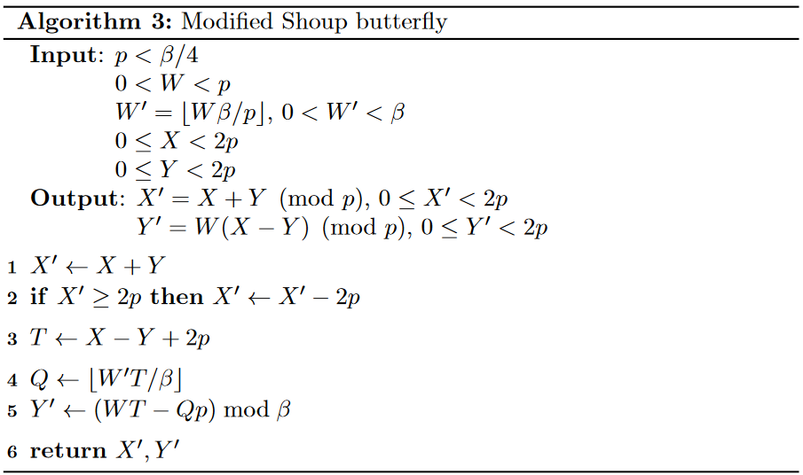
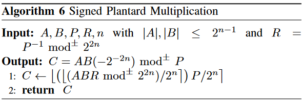

<!-- 
theme: default
size: 16:9
paginate: true
footer :  [licence](https://creativecommons.org/licenses/by-sa/4.0/) https://nindanaoto.github.io 
style: |
  h1, h2, h3, h4, h5, header, footer {
        color: white;
    }
  section {
    background-color: #505050;
    color:white
  }
  table{
      color:black
  }
  code{
    color:black
  }
    a {
    font-weight:bold;
    color:#F00;
  } 
-->

<!-- page_number: true -->

# 数論変換における最新の研究動向

京都大学 佐藤研究室 D1 松岡　航太郎

---

## 普段の研究

- 準同型暗号が専門
    - 暗号のまま計算ができる暗号
    - 今日の話も準同型暗号と密接に関わりのある話
- 研究室は集積回路
    - 今準同型暗号を高速化できるハードウェアを作ったりしてる
    - 1月にASP-DAC(韓国)でしゃべる
- 京都大学工学部電気電子工学科卒　特色入試
- 東京都立戸山高等学校卒
- 2019年度未踏スーパークリエータ
- 京都大学機械研究会

---

- Kotaro Matsuoka, Ryotaro Banno, Naoki Matsumoto, Takashi Sato, & Song Bian. (2020). Virtual Secure Platform: A Five-Stage Pipeline Processor over TFHE. 
- Kotaro Matsuoka, Yusuke Hoshizuki, Takashi Sato, & Song Bian. (2021) Towards Better Standard Cell Library: Optimizing Compound Logic Gates for TFHE.
- Ryotaro Banno, Kotaro Matsuoka, Naoki Matsumoto, Song Bian, Masaki Waga, & Kohei Suenaga. (2022). Oblivious Online Monitoring for Safety LTL Specification via Fully Homomorphic Encryption. 
- Kotaro Matsuoka, Yasutomo Yushima, Ryo Hayakawa, Riho Kawasaki, Kazunori Hayashi, Megumi Kaneko, An RFID tag identification protocol via Boolean compressed sensing

---

## 多項式乗算はおそすぎる!

- 多項式乗算はnaïveにやるとO(N²)のオーダ
    - 準同型暗号では多項式の演算はたくさん出てくる
        - これを速くすると全体が早くなる
    - 今日の話は多項式乗算を高速化した人々の成果の話

---

## オーダの限界はどこ?

- David Harvey(あとでもっかい出てくる)らが2019年に証明
    - [Integer multiplication in time O(n log n)](https://hal.science/hal-02070778/document)
    - ※多項式に基数を代入したら整数になるので多項式乗算と整数乗算はほぼ同じもの
- 現実的にはもうちょっと大きいオーダのものを使う
    - 基本的には離散フーリエ変換の仲間を使って計算をする
      - 上の論文もそう

---

## 離散フーリエ変換とは

- フーリエ変換(DFT: Discrete Fourier Transform)を離散化したもの
  - フーリエ変換は時間信号を複数の周波数成分に分解する処理
  - ここでは多項式乗算に転用するだけなのでフーリエ変換については割愛
- 入力となる多項式を$a[X]$、出力を$A[X]$としよう
- このとき離散フーリエ変換は以下のように与えられる
- 指数の符号は逆でもいい
- $e^{-i\frac{2π}{N}}$は回転因子とよぶ

$$
A_t = ∑^{N-1}_{x=0} a_x⋅e^{-i\frac{2πtx}{N}},t∈\{0,1,...,N-1\}
$$

---

## 逆離散フーリエ変換

- フーリエ変換の重要な性質として、逆変換が存在することがある
  - 離散フーリエ変換でも逆変換がありInverse DFT (IDFT)という
    - 定数倍と指数の符号くらいしか変わらない

$$
a_x = \frac{1}{N}∑^{N-1}_{t=0} A_t⋅e^{i\frac{2πxt}{N}},x∈\{0,1,...,N-1\}
$$

---

## 畳み込み定理

- フーリエ変換の重要な性質として畳み込み定理がある
  - 畳み込みはConvolutionなのでCNNのCと一緒
- これはフーリエ変換をした結果(周波数成分)の要素ごとの積をとったものの逆変換が入力の畳み込みになっているという定理
- 離散フーリエ変換での畳み込み定理が$X^N-1$を法とする多項式乗算になる
- つまり、$a[X]⋅b[X]≡c[X]\mod{X^N-1}$が以下と同値になる
  - DFTは高速フーリエ変換(FFT: Fast Fourier Transform)でO(NlogN)で計算できる

$$
\begin{aligned}
c_k &= \frac{1}{N}[\sum^{N-1}_{l=0}(\sum^{N-1}_{n=0}a_ne^{-i\frac{2\pi n k}{N}} \cdot \sum^{N-1}_{m=0}b_me^{-i\frac{2\pi m k}{N}})e^{i\frac{2\pi k l}{N}}]\\
& =  \frac{1}{N}[\sum^{N-1}_{l=0}(A_k \cdot B_k)e^{i\frac{2\pi k l}{N}}]
\end{aligned}
$$

---

## DFT(というかFFT)の欠点

1. 精度に限界がある
  - 倍精度浮動小数点数は53bitしか精度がない
  - 入力となる多項式の係数が大きくなるとOverflow
    - 余談: 準同型暗号の文脈だとこれを避ける方法はなくはない
    　- [Accelerating HE Operations from Key Decomposition Technique](https://eprint.iacr.org/2023/413)
2. 倍精度浮動小数点はHardware実装が難しい
  - 倍精度浮動小数点演算器は実装コストが大きい
    - GPUでも基本的に倍精度は性能が低い
3. 固定小数点化しても演算誤差がある
  - 最悪の場合Overflowを起こすと大きな誤差に
  - bitのすべてを値の表現に使えるとは限らなず精度も下がる

---

## 複素数でないフーリエ変換

- 余談:一般には[ポントリャーギン双対](https://ja.wikipedia.org/wiki/%E3%83%9D%E3%83%B3%E3%83%88%E3%83%AA%E3%83%A3%E3%83%BC%E3%82%AE%E3%83%B3%E5%8F%8C%E5%AF%BE)があるとフーリエ変換が定義される
- DFT以外でよく使われるのは下の2つ
1. Nussbaumer Transform
  - [Fast polynomial transform algorithms for digital convolution](https://ieeexplore.ieee.org/abstract/document/1163372)
  - 多項式の$X$の冪を回転因子として使う方法
    - 実は計算量が最小になるアルゴリズムもこれベース
  - 回転因子の計算が要素のcyclic shiftになるので扱いづらい
2. 今日の主役: 数論変換(NTT: Number Theoretic Transform)
  - 複素数の代わりに剰余環($\mathbb{Z} \bmod q$)上の値を使う
  - 複素正弦波の代わり原始$N$乗根を使う
    - $N$乗した時に初めて$1$になる数字のこと([フェルマーの小定理](https://ja.wikipedia.org/wiki/%E3%83%95%E3%82%A7%E3%83%AB%E3%83%9E%E3%83%BC%E3%81%AE%E5%B0%8F%E5%AE%9A%E7%90%86))

---

## NTTってFFTより重いんじゃない?

1. 剰余演算が重い
  - 普通に考えると$\bmod q$は割り算になるはず
2. 一般には2基底(1度に2分割)までしか高速な再帰分割がない
  - FFTなら8基底までできる

---

## NTTの高速化手法

1. 剰余演算が重い
  - 除算を使わない剰余アルゴリズムがある
    - 代表的なのはMotgomeryとBarret
2. 一般には2基底(1度に2分割)までしか高速な再帰分割がない
  - 特別な法であれば4基底以上が可能
    - $2^{64}-2^{32}+1$や$k^{r/2}⋅2^{ri}+1$

---
    
## Montgomery Reduction (1985年)

- RSA暗号の計算のべき乗によく使われる
- $q<R$を2冪の値とする
- 入力$0 \leq a<qR$に対し$0\leq aR^{-1}\bmod q < q$が返ってくる
- q' = $q^{-1} \bmod q$
- $R$をかけた状態にしてから適用する必要がある
  - アルゴリズム全体の修正が必要
- $\log_2 R$bit同士の乗算が2回ある

```
m ← ((a mod R) q') mod R
t ← (a + mq)/R //右シフト
return  t ≥ q ? t - q : t
```

---

## Signed Motgomery Reduction (2018年)

- 通常のMontgomeryは入力が正整数しか取れない
  - 減算を計算したい場合面倒
- $-\frac{qR}{2}\leq a < \frac{qR}{2}$に対し$-q<aR^{-1}\bmod q < q$が返ってくる
- $a = a_1R+ a_0$と下位と上位にわける

```
m ← a₀q' mod R
t ← ⌊mq/R⌋ //乗算の上位だけでよい
return a₁ - t
```

---

## Barret Reduction

- アイデアとしては除算を逆数との積に置き換える
- $4q<R,r=\lfloor R/q \rfloor$とする
- $0\leq a < q^2$に対し$0\leq a\bmod q < q$が返ってくる
- $2\log_2 q$bitと$\log_2 R$bitの乗算が1回と$\log_2 R$bit同士の乗算が1回
  - 一般にはMontgomeryより重い
  - NTTで使う場合には定数との掛け算をするので改良ができる
```
t ← a - q⋅⌊ar/R⌋
return  t ≥ q ? t - q : t
```

---

## (再びの)Harvery's Algorithm(2014)

- [NTL](https://libntl.org/)で使われているShoup's algorithmの改良
  - 現在最も広く使われている([Intel HEXL](https://github.com/intel/hexl)など)
- 回転因子は定数なのでそこに割り算を埋め込んでおく
- 大きな桁のかけ算がない($R$が3回で1回分は入力のかけ算)



---

## Plantard Reduction (2021)

- [Efficient word size modular arithmetic](https://eprint.iacr.org/2022/956)
- $0 \leq A,B < q$の乗算が前提のReduction
- $R$は2冪で$q<\frac{R}{\phi}, \phi = \frac{1+\sqrt{5}}{2}$
- $q' = q^{-1} \bmod R^2$
- 一般にはRの積2回(1回は入力の積)とR²の積1回
  - Barretより重い
- Bが定数だと$Bq'$を先に計算できる($R$が1回と$R$と$R^2$が1回)
  - $R^2$のかけ算1回の方が$R$のかけ算2回より早いとき有利(Rが16bit以下の時とか)

```
C ← ⌊((⌊(ABq' mod R²)/R⌋+1)q)/R⌋
return C==q ? 0 : C
``` 

---

## Signed Plantard Reduction (2022)

- [Efficient Word Size Modular Multiplication over
Signed Integers](http://crypto.mist.i.u-tokyo.ac.jp/publications/782700a094.pdf)



---

## Reductionのまとめ

1. Montgomery
  - $R^{-1}$が掛ってしまうのでアルゴリズム全体の修正が必要
  - 大体の場合で軽め($R$の乗算が2回)
2. Barret(Harvey)
  - 大きめのかけ算が必要, 一般にMontgomeryより遅いが表現の変更は不要
    - ($R^2$と$R$の乗算が1回と$R$の乗算が1回)
  - NTTだと定数乗算しかないので改善できる($R$の乗算が2回)
    - 実はメモリ的には定数2倍送らないと行けないので不利だったりはする
3. Plantard
  - 入力の乗算を除くと$R^2$の乗算が1回
    - 組み込みプロセッサで小さな法を扱うとき(耐量子計算機暗号の一部など)早い

---

## 特別な法

- 一般に2基底しかできないのは原始根の$\frac{N}{2^i}, i \geq 2$乗との積が計算しにくいから
  - FFTだと$\frac{N}{4}$乗は$i$,$\frac{N}{8}$乗は$\frac{1+i}{\sqrt{2}}$
- 逆に言えばそういう特別な原始根があるような法なら高速に計算できる
  - ここでは$2^{64}-2^{32}+1$と$k^{r/2}⋅2^{ri}+1$を紹介
    - どちらもSolinas Primeに分類される

---

## $2^{64}-2^{32}+1$

- この数字はGoldilocks primeの一つでもある
  - [Ed448-Goldilocks, a new elliptic curve](https://eprint.iacr.org/2015/625), 2015年
- 形を見ればわかるとおりReductionが非常に簡単
- $2^{192} \equiv 1 \bmod 2^{64}-2^{32}+1$
　- $64$基底まで左シフトで実装できる
- zkEVM, Plonky2, 0xPolygonなんかでもこの法をつかっているらしい

---

## $k^{r/2}⋅2^{ri}+1$

- 私が(多分最初に?)見つけて使っている数字
　- Montgomery Friendry Primeに分類できる
    - [Montgomery-friendly primes and applications to cryptography](https://eprint.iacr.org/2020/665.pdf)
    - Reductionが簡単なことは知られているが回転因子としての性質の良さは利用されていなかったらしい
- $(k\cdot 2^i)^r \equiv -1 \bmod k^{r}⋅2^{ri}+1$
  - $k$が乗算の計算しやすい値なら高速に計算できる
  - $2r$基底までできる
  - 例: $k=5,r=4,i=4,5$が使える
- $(k^{r}⋅2^{ri}+1)\cdot (k^{r}⋅2^{ri}-1) \equiv -1 \bmod 2^{ri+1}$
  - Montgomeryの$q'$が$-(k^{r}⋅2^{ri}-1)$にとれるので簡単

---

## 他にいい感じの法あるの?

- Reductionが効率的な法は知られている
  - 競技プログラミングとかで使われがち
  - 基底も大きくできるやつみつけたら教えてください