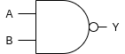
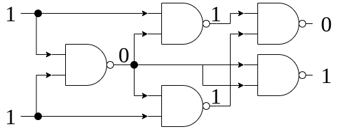

<!-- 
theme: default
size: 16:9
paginate: true
footer :  [licence](https://creativecommons.org/licenses/by-sa/4.0/)
style: |
  h1, h2, h3, h4, h5, header, footer {
        color: white;
    }
  section {
    background-color: #505050;
    color:white
  }
  table{
      color:black
  }
  code{
    color:black
  }
    a {
    font-weight:bold;
    color:#F00;
  } 
-->

<!-- page_number: true -->

# TFHE実装入門

## 0.Introduction

松岡　航太郎

---
## 自己紹介

- 京都大学大学院情報学研究科 佐藤高史 研究室 博士課程
- 京都大学工学部電気電子工学科卒　特色入試
- 東京都立戸山高等学校卒
- 2019年度未踏スーパークリエータ
- 京都大学機械研究会(2019年度NHK学生ロボコン優勝)
- 趣味は読書
- 卒業研究は超伝導体と磁性体を含む動電磁界シミュレーション
- 修士論文はTFHEのFPGA実装

---
## 目標

- TFHEのHomNANDを実装し、背景となる理論を説明できるようになること
- 目に見える目標はHomNANDのテストが動く実装の製作
- そこまでできた場合は個別の発展課題を提供可能

---

## 準同型暗号とは？

- Homomorphic Encryption
- 「暗号文のママ計算できる」暗号
- 平文に対する演算と準同型な演算を暗号上で定義できる
- 概念が提案されたのは1978年(RSAと同年)
- DARPA、Intel、IBM、Microsftなどが鎬を削っている
- 流行りの応用は医療データなどの機密性の高いデータを扱うPrivate AI
- [標準化](https://homomorphicencryption.org/standard/)の動きも在る
  - [ISO/IEC 18033-6:2019(en) IT Security techniques — Encryption algorithms — Part 6: Homomorphic encryption](https://www.iso.org/obp/ui/#iso:std:iso-iec:18033:-6:ed-1:v1:en)

---

## TFHEとは？

- Torus Fully Homomorphic Encryptionの略
- 0と1を表現する暗号文に対し、好きなだけ論理演算ができる

---

## Fully Homomorphic Encryptionとは？

- FHEとよく略す。日本語で言えば完全準同型暗号。
- 暗号文を入力として、暗号文のママ『任意』の関数を適用できるような暗号
  - 整数の暗号文であれば任意の回数加算と乗算ができることが十分条件
  - bitの暗号文であれば任意の回数NANDができることが十分条件
- TFHEは後者で論理回路として表現できる関数なら評価可能

---

## FullyじゃないHomomorphic Encryption

- 多くのHEは剰余環上の整数に対する演算をサポートしている
- PHE(Partial): 加法だけもしくは乗法だけできるHE
- SHE(Somewhat): 両方できるが、乗法の回数に暗号方式に依存した定数の制限があるもの
- LHE(Leveled): 両方できるが、パラメータ依存で乗法の回数に制限があるもの

---

## FHEの世代

- [wikipedia](https://en.wikipedia.org/wiki/Homomorphic_encryption)が詳しい
- 第1世代FHE: Gentryさんの博士論文(2009)など
- 第2世代FHE: Brakerski-Gentry-Vaikuntanathan (BGV, 2011)など
- 第3世代FHE: Craig Gentry, Amit Sahai, and Brent Waters (GSW,2013)やTFHE(2016)など
- 第4世代FHE:  Cheon Jung Hee, Kim Andrey, Kim Miran, Song Yongsoo(CKKS, 2017)

---

## NAND

- 完全系をなす論理演算。記号と真理値表を以下に示す。

|A＼B|0|1|
|---|---|---|
|0|1|1|
|1|1|0|

---

## 論理回路の例(半加算器)

---

## HomNANDの概念的な構造

---

## 章立て

0. Introduction
1. TLWE
2. TRLWE & SampleExtractIndex
3. TRGSW & CMUX
4. Blind Rotate
5. Identity Key Switching
6. HomNAND
7. FFTによる多項式乗算
8. Parameter Selection
9. 準同型論理回路実行エンジン

- Appendixは記号の定義とかをまとめる

---

## 講義の流れ

- スライドはできる限り事前に配布する。手元で見れるようにすると良い
  - 昨年と一昨年分は公開済み
- 講義のスピードに合わせる必要はない。自分で勝手に進めてわからない部分を質問するとかしてもらっても構わない。
- [原著論文](https://eprint.iacr.org/2018/421)と原著者実装をみるだけでも実装することは可能。講義はつまづきやすい場所を潰すためのもの
  - 論文と実装の間で理論に差異があり、講義では実装側によせた内容をやる
  - 説明を簡単にするため一般性を損なっている部分がある
- 各章では該当する部分の理論を説明してから、具体的実装法を説明する

---

## 実装について

- 講師が見れる形にすること
  - 例年通りなら実装の存在を持ってゼミに参加した実態の証拠として扱う
- 言語はC,C++,Pythonだとサポートしやすい
  - Rustも多分大丈夫
- 講師はLinux(Ubuntu)で開発している
- 目に見える目標はHomNANDのテストが動く実装の製作

---

## 発展的な内容(1/4)

- CPUをTFHE上で動かす
  - 講師のメインの研究
- High Level Synthesisとの連携
  - この２つは、論理回路を直接設計するのではなくC言語とかを実行しようという試み
- FPGA,OpenCL,CUDAでの実装
  - CPUで出せる速度には限界が在るのでアクセラレータを作るのは試みがいくつか在る
- Deep Learningへの応用
  - 流行り

---

## 発展的な内容(2/4)

- Multi Keyの実装
  - 通常の準同型暗号は鍵を作るパーティは１つだが、複数パーティがつくることで同意しないと復号できないようにする
- 他のFHEとのスイッチング
  - BFVやCKKSとTFHEは相互に変換できることが知られている
- Determinstic Weighted Finite Automaton
  - TFHEでオートマトンを評価できる
- Circuit Bootstrapping
  - TLWEとTRGSWの変換

---

## 発展的な内容(3/4)

- Pass Transistor Logic
  - External Productがスイッチとして使えることを利用する
- Universal Circuit over TFHE
  - FPGAのようにLUTを暗号上で組んでそれをつなぐことで回路のトポロジはばれるがゲートの内容は隠すことができる
- Garbled Circuit over TFHE
  - 準同型暗号上でGCを評価する(実態としてはAESの復号回路)とmalleability(準同型暗号上の評価は依頼されたものと違うものをしていても区別がつかない)が解消できる
- パラメータの自動選定
  - TFHEのセキュリティパラメータは性能とセキュリティの間のトレードオフが在るので自動で決めたい

---

## 発展的な内容(4/4)

- Programmable Bootstrapping
  - 整数をとって整数を返すBootstrappingの実装
- Batch Bootsrapping
  - 複数のLWEを一度にBootstrappingする
- Key compression
  - 鍵のnonce部分をCSPRNGのseedに置き換える

---

## 参考文献

- [C++実装(講師作)](https://github.com/virtualsecureplatform/TFHEpp)
- [Python実装(講師作)](https://github.com/virtualsecureplatform/pyFHE/tree/PurePython)
- [CUDA実装(講師編)](https://github.com/virtualsecureplatform/cuFHE)
- [C++実装(2020年度チュータ作、おそらくいちばんスライドに忠実)](https://github.com/ushitora-anqou/aqtfhe3)
- [C++実装(原論文著者作)](https://github.com/tfhe/tfhe)
- [C++実装(アカデミック)](https://github.com/openfheorg/openfhe-development)
- [Rust実装(Zama製,Zamaは原著者の作った会社)](https://github.com/zama-ai/tfhe-rs)
- [Julia実装(NuCypher製)](https://github.com/nucypher/TFHE.jl)
- [Ruby実装(Klemsaさん製)](https://gitlab.fit.cvut.cz/klemsjak/wtfhe)
- [原論文](https://eprint.iacr.org/2018/421)
- [Zamaによる解説記事](https://www.zama.ai/post/tfhe-deep-dive-part-1)