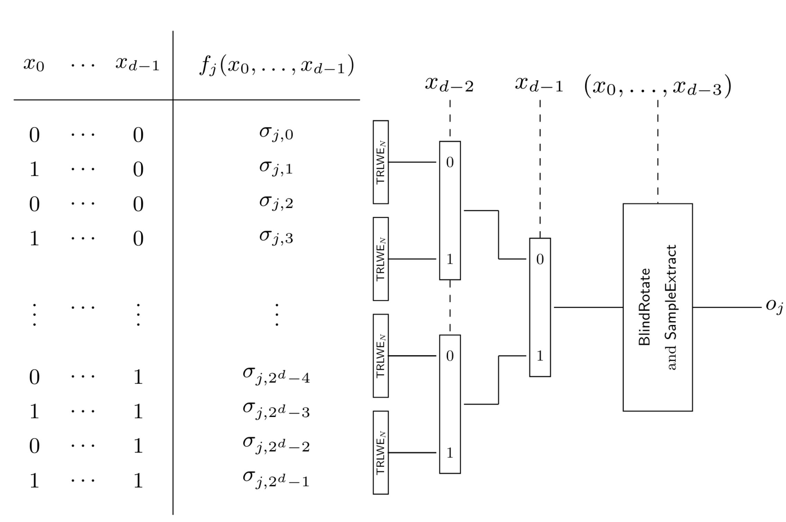
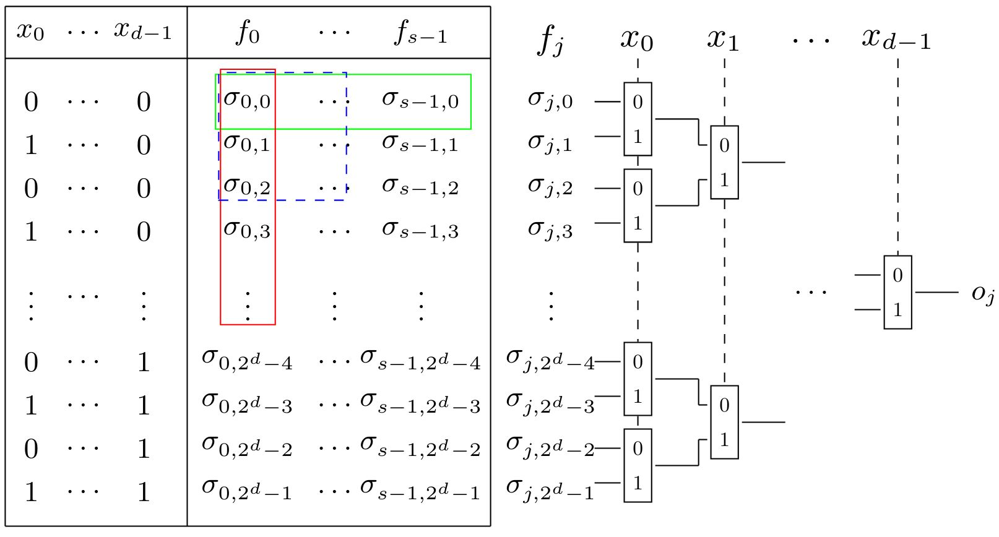
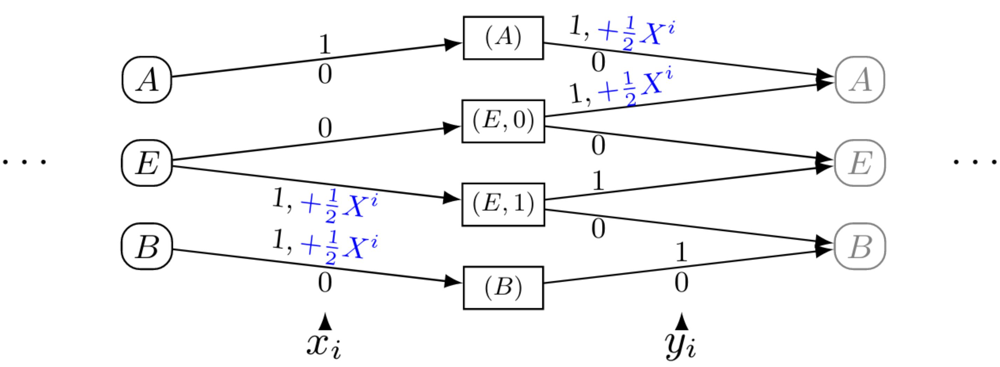
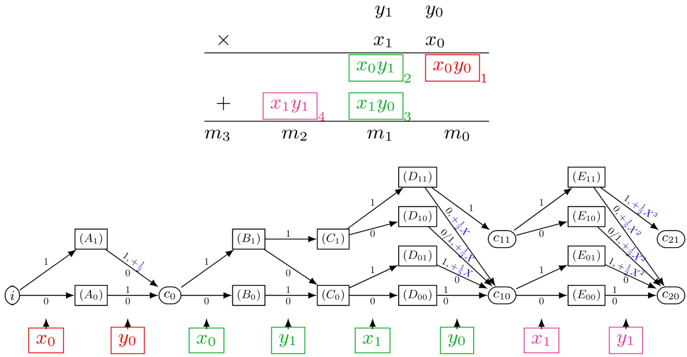
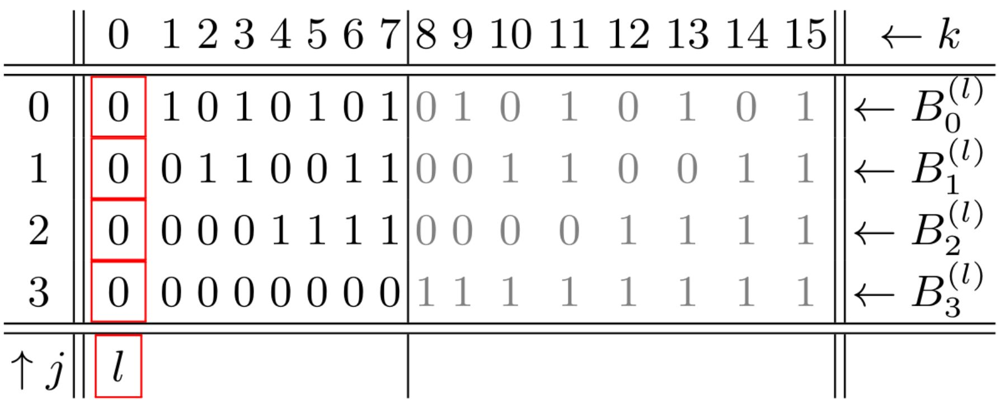
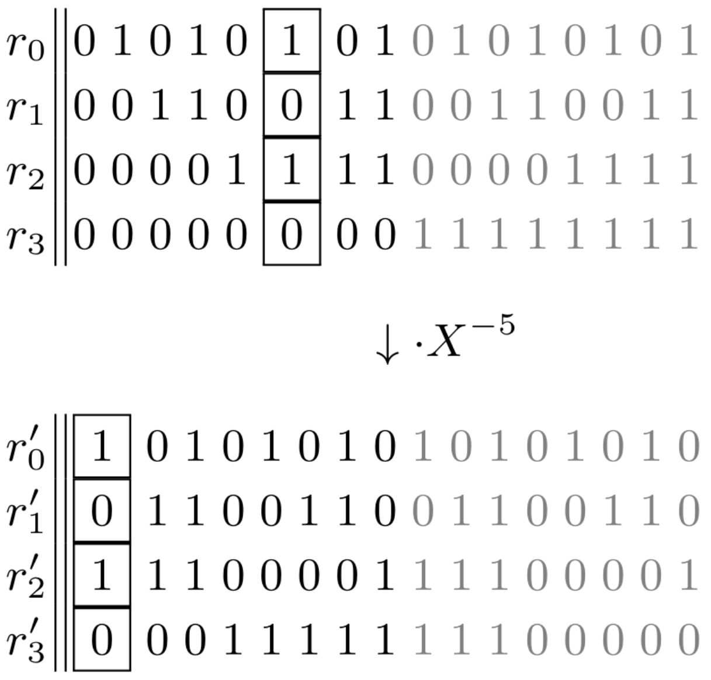
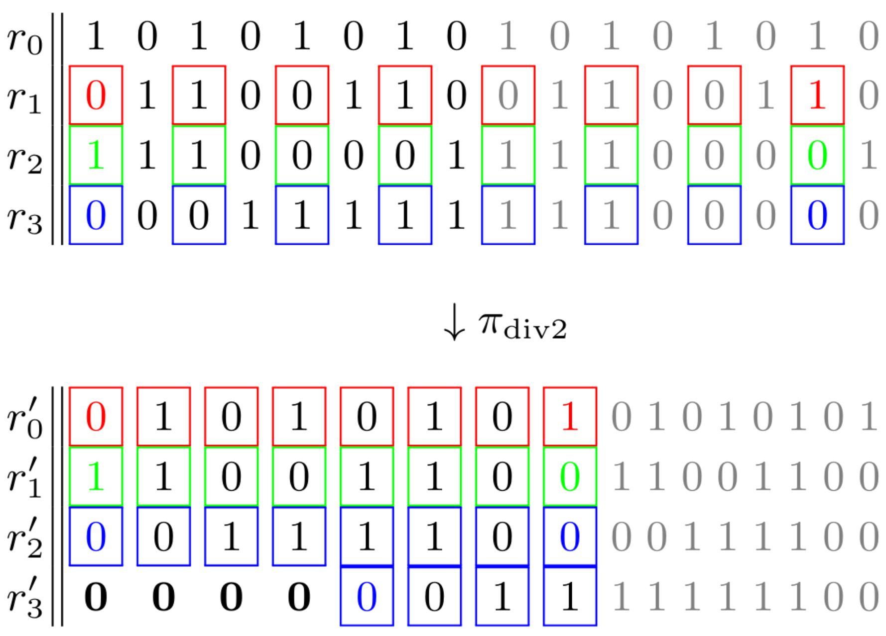

<!-- 
theme: default
size: 16:9
paginate: true
footer :  [licence](https://creativecommons.org/licenses/by-sa/4.0/)
style: |
  h1, h2, h3, h4, h5, header, footer {
        color: white;
    }
  section {
    background-color: #505050;
    color:white
  }
  table{
      color:black
  }
  code{
    color:black
  }
    a {
    font-weight:bold;
    color:#F00;
  } 
-->

<!-- page_number: true -->

# TFHE実装入門

## 8.LHE mode Algorithm

松岡　航太郎

---

## 扱う内容(概要)

- 今までの話はHomNANDをどうやって作るかという話
  - これはTFHEのFHEとしての機能
- 今回扱うのはCMUXを使うことで達成できる機能について
  - TFHEのLHEとしての機能
  - Bootstrappingをしないのでノイズが増え続ける
  - $N$を大きくすれば同じセキュリティを達成するのに必要なノイズの最小値が小さくなるのでより多くの演算に耐えられる
- 図は[原著論文](https://eprint.iacr.org/2018/421)からとってきている

---

## 扱う内容(目次)

1. Horizontal/Vertical Packing
  - CMUXでLUTを評価する
2. detWFA
  - CMUXでオートマトンを評価する
3. TBSR
  - CMUXで加算や乗算をより効率よく評価する

---

## LHE mode Algorithmの入出力

- CMUXのセレクタに入れるのはTRGSWだけ
  - 基本的に入力はTRGSWとして表現される
  - セレクタがPublicならCMUXの演算はいらないので自然といえば自然
- CMUXのデータ入力と出力はTRLWE
  - これはPublicなものとして自明な暗号文でもいいし暗号文として入力で渡してもいい

---

## CMUXでのLUTの評価

- まずはナイーブな場合を考える
  - $d$-bitのindexを受け取り、$N$bitの出力を返すLUTを考えよう
  - 入力は$d$個のTRGSW
  - $2^d$個のTRLWEにそれぞれのindexに対応した$N$bitを係数として入れておく
    - これをツリー状のCMUXで選択するだけで良い

---

## Vertical Packing

- 評価する関数は1つだが、出力bit数が$\frac{N}{2^o},o∈ \mathbb{N}$の場合を考えよう
- このとき、1つのTRLWEに下位$o$bitが一致するindexに対応する$2^o$個の出力を詰めることができる
  - 上位$d-o$-bitに関してはツリー状のCMUXをやるので変わらない
  - 下位$o$-bitに関しては$X$のべき乗を掛けたものとCMUXする
  - TRLWE自体の数が減るのでメモリが減るしCMUXの数が減るので計算量も減る

---

## Horizontal Packing

- 同じ$d$-bitのindexを受け取る$m$個の関数が存在するとしよう
- もしこの関数達の出力bit数の和が$N$以下なら同じTRLWEにそれらの出力を詰めることで一回のLUTの評価で複数の関数を一度に評価できる
  - 例えば$m|N$でそれぞれの関数の出力bit数が$\frac{N}{m}$なら$i∈[0,m)$個目の関数が$[i\cdot\frac{N}{m},(i+1)⋅ \frac{N}{m})$次の係数を使えば良い

---

## detWFA

- deterministic Weighted Finite Automata
  - 決定性重み付き有限オートマトン
    - オートマトンが数値を保持することができて、状態を遷移するときに遷移に紐付けられた重みをそこに加算する
      - 入力を受取り終わったときの重みを出力として返す
      - TFHEの場合はTRLWEが数値を保持することになる
    - DFAより広いクラス

---

## TFHEにおけるdetWFAのアイデア

- 大きな問題点は終状態がわからないこと
  - 入力が暗号化されているのですべての入力を受け取り終わったときどの状態にいるかはわからない
- 始状態は必ず１つなのだから終状態の候補から始状態へと入力を逆に流していけばよいのでは？
  - 重みは逆向きに通っても同じ
  - 誤った経路のものはCMUXで落とされていく

---

## detWFAによるアルゴリズム(Max)

---

## detWFAによるアルゴリズム(乗算)

---

## DFAの実装方法

- detWFAはDFAのスーパーセットなので当然DFAも評価できる
  - 終状態がDFAの受理状態に相当するところから遷移するときには非零の値を加算して残りの重みはすべて0にしておけば良い
    - 受理状態から始状態に到達した場合だけ非零になる

---

## TBSR

- Torus Bit Sequence Representation
  - TRLWEの平文の各係数を$\{-\frac{1}{4},\frac{1}{4}\}$にとり、0と1を表現することでTRLWEで整数を表現
    - たぶん$\{0,\frac{1}{2}\}$のほうがいい気もする
  - 平文との加算やシフト演算を可能にするために現在の値以外にとりうる値すべてを保持し、先頭に現在の値が来るようにするようなデータ形式である
    - ナイーブには図の各行を一つのTRLWEをで保持する
      - つまり1bitにTRLWEを１つ使う
- CMUXで加算などを実装するより効率は良いと主張されている

---

## TBSRでの加算
- 定数の加算は$X$の冪を掛けるだけで良い
  - 暗号文との加算は掛けてないものとのCMUXをすれば良い
  - 負巡回とオーバーフローは違うことには注意

---

## TBSRでの右シフト

- 一番下のbitに対応するTRLWEを削除、偶数番目の係数を削除して詰め、最上位bitのTRLWEを生成すれば良い
  - 線形な演算なのでTRLWEからTRLWEへのKey Switchingとして実装できる

---

## 参考

- [TFHEppのTBSR加算実装](https://github.com/virtualsecureplatform/TFHEpp/blob/master/test/bitsequencerepresentation.cpp)(encoded messageが{-1/8,1/8}に取られててミスってる)
- [TFHEppのROM実装](https://github.com/virtualsecureplatform/TFHEpp/blob/master/include/cmuxmem.hpp)
- [aqTFHEのDFA実装](https://discord.com/channels/861779650702737428/869104585703317546/888266261862154320)