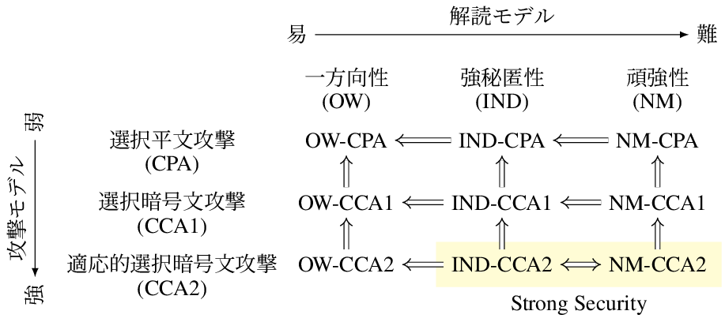

<!-- 
theme: default
size: 16:9
paginate: true
footer :  [licence](https://creativecommons.org/licenses/by-sa/4.0/)
style: |
  h1, h2, h3, h4, h5, header, footer {
        color: white;
    }
  section {
    background-color: #505050;
    color:white
  }
  table{
      color:black
  }
  code{
    color:black
  }
    a {
    font-weight:bold;
    color:#F00;
  } 
-->

<!-- page_number: true -->

# TFHE実装入門

## 10. IND-CPAᴰ

松岡　航太郎

---

## IND-CPAとは

- IND-CPAᴰを説明する前にベースとなるIND-CPAの説明をする必要がある
    - INDはIndistinguishablity(識別不能性)の略
    - CPAはChosen Plaintext Attack(選択平文攻撃)の略
- 攻撃者は任意の平文に対する暗号文をchallengerから得ることができるとする
    - 好きなだけそのような暗号文を得た後に2つの平文候補をchallengerに送る
    - challengerはそのどちらかをランダムに選んで暗号化して返す
    - 攻撃者はどちらが暗号化されたかわかるか？
- 暗号文から部分的な情報を取り出せるかどうか(Semantic Security)をINDは含んでいる

---

## IND-CPA以外の一般的な安全性

- 

---

## 安全性の関係

- NMはNon-Malleability(頑強性)の略
    - 雑に言うと準同型性がないこと
        - 定義から行って準同型暗号はこれを満たすことができない
        - IND-CCA2は達成不能(多くの実用的暗号はこれを満たす)

[図の出典](https://tex2e.github.io/blog/crypto/pubkey-crypto-security-relation#fn:indistinguishability)