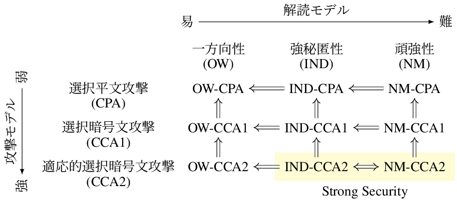

<!-- 
theme: default
size: 16:9
paginate: true
footer :  [licence](https://creativecommons.org/licenses/by-sa/4.0/)
style: |
  h1, h2, h3, h4, h5, header, footer {
        color: white;
    }
  section {
    background-color: #505050;
    color:white
  }
  table{
      color:black
  }
  code{
    color:black
  }
    a {
    font-weight:bold;
    color:#F00;
  } 
-->

<!-- page_number: true -->

# TFHE実装入門

## 10. IND-CPAᴰ

松岡　航太郎

---

## IND-CPAとは

- IND-CPAᴰを説明する前にベースとなるIND-CPAの説明をする必要がある
    - INDはIndistinguishablity(識別不能性)の略
    - CPAはChosen Plaintext Attack(選択平文攻撃)の略
- 攻撃者は任意の平文に対する暗号文をchallengerから得ることができるとする
    - 好きなだけそのような暗号文を得た後に2つの平文候補をchallengerに送る
    - challengerはそのどちらかをランダムに選んで暗号化して返す
    - 攻撃者はどちらが暗号化されたかわかるか？
- 暗号文から部分的な情報を取り出せるかどうか(Semantic Security)をINDは含んでいる

---

## IND-CPA以外の一般的な安全性

- IND以外の解読モデル
- OW: OneWay(一方向性)
  - 暗号文から平文を得ることが困難(平文以外は漏れるかも)
- NM: Non-Malleability(頑強性)
  - 雑に言うと準同型性がないこと
      - 定義から行って準同型暗号はこれを満たすことができない
- CPA以外の攻撃モデル
- CCA1: Chosen-Ciphertext Attack(選択暗号文攻撃)
  - 任意の暗号文に対して平文が得られるモデル(復号オラクルが存在する)
- CCA2: Adaptive chosen-ciphertext attack(適応的選択暗号文攻撃)
  - CCAで復号する暗号文をそれまでの復号結果に依存して選ぶモデル

---

## 安全性の関係

- IND-CCA2は準同型暗号は達成不能(多くの実用的暗号はこれを満たす)
  - IND-CCA1はできる

[図の出典](https://tex2e.github.io/blog/crypto/pubkey-crypto-security-relation#fn:indistinguishability)

---

## IND-CPAᴰ

- 名前の通りIND-CPAの拡張
  - "限定的な"復号オラクルの存在を仮定するモデル
    - CPAなので暗号文の平文を攻撃者は知っている
    - 単に得た暗号文の平文を知っても情報は増えない
- 準同型暗号の場合, 格子暗号であるため平文に加えエラーが存在する
  - エラーはchallengerが生成しているのでこの情報は攻撃者にとって新規
  - めちゃくちゃざっくりいうと未知の暗号文のエラーのを推定したい
    - わかりやすい例としては既知の暗号文のエラーがわかれば秘密鍵が分かる
      - これはIND-CPAᴰより強い攻撃なのでKRᴰ(Key Recovery)という別の名前
    - CKKSの場合, 平文とエラーの間の区別がないのでエラーがそのまま伝わってしまう
      - KRᴰが可能
---

## TFHEにおけるIND-CPAᴰ

- [IDN-CPAᴰの最初の論文](https://eprint.iacr.org/2020/1533)ではTFHEは脆弱性の対象から除外されていた
  - エラーは復号後の平文に含まれないため
- [今年の論文](https://eprint.iacr.org/2024/127)でTFHEにも適用されることが示された
  - BlindRotateは一種の復号でここでエラーが十分大きいと結果がおかしくなる
  - 結果がおかしければ復号がおかしくなっていることが分かる
    - ノイズの大きさが大体わかる
    - TFHEじゃなくてBFVとかでも同様

---

## 参考文献

- [IDN-CPAᴰの最初の論文](https://eprint.iacr.org/2020/1533)
- [TFHEのIND-CPAᴰ](https://eprint.iacr.org/2024/127)