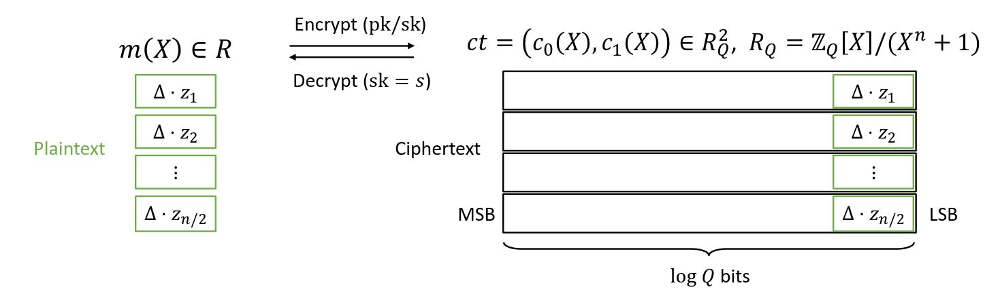

<!-- 
theme: default
size: 16:9
paginate: true
footer :  [licence](https://creativecommons.org/licenses/by-sa/4.0/)
style: |
  h1, h2, h3, h4, h5, header, footer {
        color: white;
    }
  section {
    background-color: #505050;
    color:white
  }
  table{
      color:black
  }
  code{
    color:black
  }
    a {
    font-weight:bold;
    color:#F00;
  } 
-->

<!-- page_number: true -->

# TFHE実装入門

## 9.CKKS

松岡　航太郎

---

## CKKSとは

- 第４世代FHE
- 著者のCheon Jung Hee, Kim Andrey, Kim Miran, Song Yongsooの頭文字
  - ソウル大の人々
  - Song Yongsoo先生は未だにソウル大で論文を出しているので名前を見かける
    - Double Decompositionもこの先生
- 固定小数点演算をサポートする準同型暗号
  - Packingする場合は固定小数点表記の複素数の場合も
- 基本的にはBFVの平文の表現を変更したもの
  - そういう意味では第２世代なきもしている
  - しかし乗算のアルゴリズムがちょっと違う

---

## 多項式を平文とするCKKS

- $\Delta$は平文の小数点の位置を決めるパラメータ
- 暗号化は以下の通り
$$b[X] = a[X] \cdot S[X] + \lceil m[X] \cdot \Delta \rfloor + e[X]$となる$(a[X],b[X])$$
- ほぼBFV
  - ただし$\Delta$が$q$に比べてかなり小さい値を取ることが多い
  - BFVでは上から$t$だけ下がったところに$m[X]$を置く
    - CKKSでは下から$\Delta$だけ上がったところに$m[X]$を置く
      - $e[X]$と下の方のbitがかぶさることも許容される
      - 固定小数点と言う言い回しを使うのはこれが原因
      - approximateと言う単語が使われることもある

---

## 平文の位置のイメージ図

---

## CKKSの乗算

- 加算はTFHEと同じなので割愛
$$
\begin{aligned}
(b_0[X] -  a_0[X] \cdot S[X]) \cdot (b_1[X] - a_1[X]\cdot S[X]) &= (\lceil m_0[X] \cdot \Delta \rfloor + e[X]) \cdot (\lceil m_1[X] \cdot \Delta \rfloor + e_1[X])\\
b_0[X] \cdot b_1[X] - (a_0[X] \cdot b_1[X] + a_1[X] \cdot b_0[X]) \cdot S[X] + a_0[X] \cdot a_1[X] \cdot S[X]^2 & \approx  \lceil m_0[X] \cdot m_1[X] \cdot \Delta^2 \rfloor + e_2[X]\\
\end{aligned}
$$
- BFVと違って$\Delta$でわる必要がない
  - $\Delta$を十分小さく取っていれば$\lceil m_0[X] \cdot m_1[X] \cdot \Delta^2 \rfloor < q$
    - オーバフローを起こさないので割らなくてもいい
      - $\Delta$で割ってはいけない理由もない気もしないでもないのだが割らないほうが主流という認識
        - 個人的には割ったほうがノイズの増加が遅い気がするのだが......?
- $\Delta$はどんどん大きくなっていくので$\Delta$も乗算回数に影響を及ぼす
- Relinearlizationも同じ

---

## Rescale

- 高速化とノイズを抑えるために係数の桁を落とすだけの操作
  - ノイズが大きくなってくると下の方の桁を保持する意味がない
  - 桁が小さければ大抵の場合計算も高速
  - 桁の大きさがそのままノイズの増幅率になるのでそれも抑えたい
- 各係数の$q$bitの下から何bitかを丸めて捨てる
  - 大体の場合$\Delta$くらい捨てれば良い

---

## Packing

- CKKSのPackingはFFTをベースにしている
  - 固定小数点が扱えるので, FFTをした結果に値を埋め込むことができる
$$b[X] = a[X] \cdot S[X] + \lceil FFT(m[X]) \cdot \Delta \rfloor + e[X]$$
- この場合$m[X]$は複素数係数として再解釈されるので複素数のベクトルを平文とする暗号文になる
  - 実数としては$N/2$しか埋め込めない
  - BFVでの分解の仕方は剰余環に対するものなのでCKKSでは扱いづらい
    - Rescaleで下のbitを破壊するのが非線形な変換をかけてしまう場合がある
    - Rescaleの仕方を工夫すればできる気がする？

---

## Slot2Coeff/Coeff2Slot, Bootstrapping

- BFVではNTTだったのがFFTになっただけなのでSlot2CoeffとCoeff2Slotもだいたい同じ
  - 複素数の計算をしないといけないのでちょっと面倒だったはずだが
- Bootstrappingはほとんど何も知らない......
  - 確かSin関数を評価するのが一番ベーシックだったはずだが
  - CKKSのBootstrappingは実装しようとしたことがない
  - 最近高精度化が進んでいるらしいので持っている知識は多分古い

---

## Residual Number  System (RNS)

- BFVと共通の話
- $e[X]$を十分小さく取るには$q$を十分大きく取らないといけない
  - 数百bitオーダになることも
- $q$を中国剰余定理で複数の素数に分解することで計算を高速化する
  - この方法をRNSと呼ぶ
  - なぜCRTじゃないのかはよくわからない
- RelinealizationのときはExtarnalProductと同様に基数で分解する
  - RNSの表現から$q$の表現に変換してから計算する
  - これが地味に面倒なのでこのコストを下げようとする研究を見た記憶はある

---

## RNSでのRescale

- RNSの場合, 下から何bitか捨てるという操作が定義しづらい
  - 基数表現ではないため
- RNSでのRescaleは$q$を分解した法のうち一つを捨てる
  - $q$での表現に変換して捨てる法を$p$とすると$q/p$倍して丸め$q/p$で剰余をとる
- これをするために$q$は大体$\Delta$くらいの大きさの法に分解できるように選ぶ
---

## 参考文献

- [Introduction to CKKS](https://inferati.com/blog/fhe-schemes-ckks)
- [CKKS Deep Dive](https://blog.openmined.org/ckks-explained-part-1-simple-encoding-and-decoding/)
- [Yongsoo Song先生のスライド](https://yongsoosong.github.io/files/slides/intro_to_CKKS.pdf)