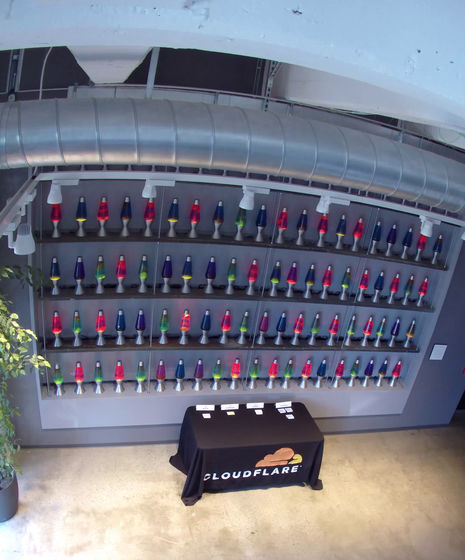

<!-- 
theme: default
size: 16:9
paginate: true
footer :  [licence](https://creativecommons.org/licenses/by-sa/4.0/)
style: |
  h1, h2, h3, h4, h5, header, footer {
        color: white;
    }
  section {
    background-color: #505050;
    color:white
  }
  table{
      color:black
  }
  code{
    color:black
  }
    a {
    font-weight:bold;
    color:#F00;
  } 
-->

<!-- page_number: true -->

# 乱数生成器LT

京都大学大学院情報学研究科情報学専攻通信情報システムコース 
佐藤 高史研究室 博士課程2年
2019年度未踏 OB

松岡　航太郎

---

# 自己紹介

---

# 乱数生成器とは?

- こないだセキュリティキャンプの受講生に中身を聞かれたのでまとめてみるついでに
- 名前の通り乱数を生成するオブジェクトのこと
- 大きく分けて3つに分かれる
    - True Random Number Generator (TRNG)
    - Non-cryptographic PRNG
    - Cryptographically Secure Pseudo RNG (CSPRNG)

---

# TRNG

- 物理的な現象から乱数を生成するもの
- 著名な方式: CPUの熱ノイズ, [LavaRand](https://gigazine.net/gsc_news/en/20240325-cloudflare-london-office-swinging-pendulums/)
- Pros: 物理的に乱数の性質が補償できる
- Cons: 乱数の生成速度が非常に遅い
    - 使用する物理現象のタイムスケールに律速される

---

# Non-cryptographic PRNG

- 多くの場合乱数生成器というとこれのこと
    - 疑似(Pseudo)乱数生成器なのでSeed値と呼ばれる別の乱数生成器の出力を受け取る
        - TRNGの出力や/dev/(u)randomなどを使うことが多い
- 著名な方式: Xorshift, Mersenne Twister, 線形合同法
- Pros: TRNG(と多くの場合CSPRNG)に比して大幅に高速
    - ゲーム, 数値シミュレーション, IC検証など乱数の品質より生成コストが重要な場合に用いられる
- Cons: 乱数の品質が低い
    - ここでいう品質というのはforward security, backward securityや統計テストによる評価など
    - foward security: 出力の一部が分かったときにそれ以降の出力を予測できるか？
        - backwardはそれ以前を予測する
    - 統計テスト: BigCrush, TestU01, Diehardなど

---

# Cryptographically Secure PRNG

- 暗号学的な安全性が何らかの意味で補償できる乱数生成器のこと
- 著名な方式: AES CTR_DRBG ((NIST SP 800-90)[https://nvlpubs.nist.gov/nistpubs/SpecialPublications/NIST.SP.800-90Ar1.pdf]), Fortuna(FreeBSDで使用), ChaCha20 (Linux)

---
