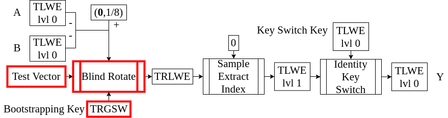
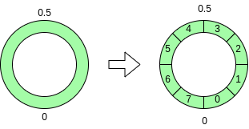
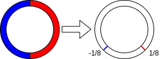
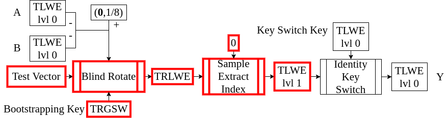

<!-- 
theme: default
size: 16:9
paginate: true
footer :  [licence](https://creativecommons.org/licenses/by-sa/4.0/)
style: |
  h1, h2, h3, h4, h5, header, footer {
        color: white;
    }
  section {
    background-color: #505050;
    color:white
  }
  table{
      color:black
  }
  code{
    color:black
  }
-->

<!-- page_number: true -->

# TFHE実装入門

## 4.Blind Rotate

松岡　航太郎

---

## 説明内容のHomNANDでの位置づけ



---

## Blind Rotateとは

- 多項式(TRLWE)を"回転"させる準同型演算
- "回転"とは要は$X$のべき乗をかけるということ
- べき乗の指数はTLWElvl0によって決まる
- 入力としてTRLWEとTLWElvl0を1つずつの他に$n$個のTRGSWをとる
- 入力となるTRLWEは特別にTest Vectorと呼ぶ
- このスライドではTRLWE=Test Vectorである
- このTRGSWはlvl0の秘密鍵を1bitずつ暗号化したものでBootstrapping Keyと呼ぶ
- Test Vectorをうまく選ぶことでTLWElvl0からTRLWEへの関数を作ることができる

---

## TLWEの丸め

- べき乗の指数は整数でないと困るのでTLWEを丸める必要がある
- 指数として意味がある範囲は$[0,2N)$
- ∵$X^{2N}⋅a[X]≡a[X] \mod{X^{N}+1}$
- ∴TLWEを$2N$倍して各係数を$[0,2N)$に丸めると意味のある数値がとれそう
- これはTorus上での丸めの準同型演算になっている(ノイズもはいるが)
- $X^{2N}$で元に戻るので、丸めた値は$2N$を法とする剰余環上の値とみなせる
- $⌈2N⋅(b-\mathbf{a}⋅\mathbf{s})⌋\mod{2N}≈⌈2N⋅b⌋-∑_{i=0}^{n-1}⌈2N⋅a_i⌋⋅s_i \mod{2N}$
- 区間が反時計回りに並ぶほうが綺麗なので$X^{⌈2N⋅(\mathbf{a}⋅\mathbf{s}-b)⌋}$にする
- 図は$N=4$の場合の例


---

## Blind Rotateのアイデア

- 実現したい演算は与えられたTRLWEを$X^{⌈2N⋅(\mathbf{a}⋅\mathbf{s}-b)⌋}$倍すること
- しかし、秘密鍵をそのまま教えるわけには行かない
- TRGSWに秘密鍵を暗号化し(Bootstrapping Key)CMUXで各bitが1か0かを反映
- Blind RotateとSample Extract IndexでTLWElvl0からTLWElvl1への関数が作れる
- ∵Blind RotateによってTLWElvl0の値に応じてTRLWEの係数の位置と符号が変化するので、Sample Extract Indexで取り出す値が変わる
- ∴$[0,N)$で$1/8$を、$[N,2N)$で$-1/8$を取り出せるようにTRLWEを決めれば復号の準同型演算(Bootstrapping)に近いものが得られる
- TLWElvl1からTLWElvl0に変換しないといけないが、その方法は次回


---

## Blind Rotateの具体的アルゴリズム

- $N=2^{Nbit}$とする(この講義のパラメータでは$Nbit=10$)
- 実装では2行目を$X^{2N-b̃}$とすると$X$の冪との乗算が正の指数だけになって楽
```
BlindRotaete((𝐚,b),𝐁𝐊,(a[X],b[X]))
  b̃=((b + (1<<(31-Nbit-1)) ) >> (32-Nbit-1))//足し算は四捨五入をするため
  trlwe = X⁻ᵇ̃⋅(a[X],b[X]) //ここで指数が正であることを仮定すると下のループと同じ関数が使えるので上で引き算をしている
  for i from 0 to n-1
    ã=(aᵢ + (1<<(31-Nbit-1)) ) >> (32-Nbit-1)
    trlwe = CMUX(𝐁𝐊ᵢ,Xᵃ̃⋅trlwe,trlwe)//Dec(𝐁𝐊ᵢ)?Xᵃ̃⋅trlwe:trlwe
  return trlwe
```

---

## 自明な暗号文

- $[0,N)$で$1/8$を、$[N,2N)$で$-1/8$を取り出せるようなTRLWE(Test Vector)は平文の係数が全て$1/8$であるような暗号文
- これを普通に暗号化すると平文がわかっている暗号文を送ってしまうことになるし、ノイズも増える
- 実は$b[X]$を平文のTorus係数多項式そのままとし$a[X]$を0とすると有効な暗号文
- 秘密鍵も乱数生成器もなしで常に生成できる暗号文なので自明な暗号文と呼ぶ
- もちろん情報を守ることはできないので使いどころは限られる

---

## GateBootstrapping TLWE to TLWE(概略)

- 全ての係数が$1/8$であるような自明なTRLWEを入力としたBlind Rotateを行い、その出力の第0項目をSample Extract Indexで取り出す操作の名前
- 出力となるTLWElvl1のノイズはTLWElvl0のノイズにかかわらず一定になる(ノイズがリセットされる)
- ∵TLWElvl1のノイズは$n$回のCMUXによるノイズのみで固定



---

## GateBootstrapping TLWE to TLWE(疑似コード)

```
GateBootstrappingTLWEtoTLWE((𝐚,b),𝐁𝐊)
  testvec = (0,0)
  for i from 0 to N-1
    testvec += (0,μXⁱ)
  trlwe = BlindRotate((𝐚,b),𝐁𝐊,testvec)
  return SampleExtractIndex(trlwe,0)
```

---

## Blind Rotateで最低限実装するべきもの

- TRLWEを全ての係数が$1/8$であるような自明な暗号文とした場合のBlind Rotate
- GateBootstrapping TLWE to TLWE
