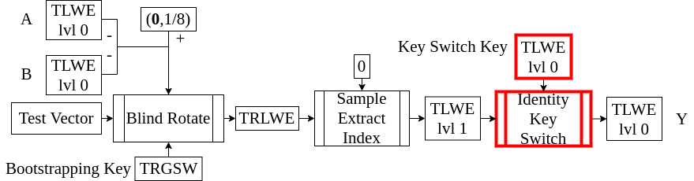

<!-- 
theme: default
size: 16:9
paginate: true
footer :  [licence](https://creativecommons.org/licenses/by-sa/4.0/)
style: |
  h1, h2, h3, h4, h5, header, footer {
        color: white;
    }
  section {
    background-color: #505050;
    color:white
  }
  table{
      color:black
  }
  code{
    color:black
  }
-->

<!-- page_number: true -->

# TFHE実装入門

## 5.Identity Key Switch

松岡　航太郎

---

## 説明内容のHomNANDでの位置づけ



---

## Identity Key Switchとは

- "Key Switch"は一般に暗号文を復号することなしに秘密鍵を変更することを言う
- ここでの"Identity Key Switch"はTLWElvl1をTLWElvl0に切り替える操作のこと

---

## Identity Key Switchのアイデア

- ここではTLWElvl1の鍵を$\mathbf{S}$と書く($s[X]$の係数のベクトル)
- TLWElvl1の$b-\mathbf{a}⋅ \mathbf{S}$をTLWEWlvl0を使って準同型的に演算する
- つまり$(\mathbf{ã},b̃)$は出力となるTLWElvl1として以下を満たすようにする
$b̃-\mathbf{ã}⋅\mathbf{s} ≈ b-\mathbf{a}⋅ \mathbf{S}$
- これはTLWElvl1と平文がノイズを除いて一致するようにするということ

---

## Identity Key Switchの素朴な実装法(スケーリングのみ)

- 論文とはずれるが、TRGSWと同じ流れで説明をしよう
- スケーリングが2のべきである必要はないが実装が簡単になるので仮定する
- $basebit∈\mathbb{Z}^+$はExternal Productの$Bgbit$にあたるもの
- $\mathbf{KS}$を$KS_i$が$\frac{s_i}{2^{basebit}}$を平文とするTLWElvl0であるとする
$(\mathbf{ã},b̃) = ∑^{N-1}_{i=0}⌈2^{basebit}⋅a_i⌋⋅KS_i$
- これで$b-\mathbf{a}⋅ \mathbf{S}$を準同型的に演算できるが、ノイズが大きすぎる

---

## Identity Key SwitchにおけるDecomposition的基数展開

- TRGSWと同じように、スケーリングだけだとだめなのでDecompositionもする
- 桁数を$t$とする($l$に相当する)

```
b̃=b
for i from 0 to n
  ã = 0
offset = 1 << (32 - (1 + basebit)) //四捨五入のため
for i from 0 to N
  āᵢ = aᵢ+offset //ここでTorusから整数に変わっていると考えていい
  for j from 0 to t-1
    âᵢⱼ= (āᵢ >> (32 - (j+1)⋅basebit))&(2ᵇᵃˢᵉᵇⁱᵗ - 1)
    (𝐚̃,b̃) -= âᵢⱼ ⋅ KSᵢ
return (𝐚̃,b̃)
```
---

## Identity Key Switchの具体的実装(乗算を要素選択に置き換える)

- 前のスライドのものでもだめなわけではない
- External Productと違ってここでは整数との積なので取れる値が限られている
- $\mathbf{KS}$を$KS_{ij}$が$\frac{j⋅s_i}{2^{basebit}}$を平文とするTLWElvl0と定義し直す($j ∈ [1,2^{basebit} - 1]$)
- こうしても$\mathbf{KS}$のデータサイズはは$2^{basebit}-1$倍にしかならない
- $j=0$の場合に関しては足す必要がないので保持しなくていい

---

## Identity Key Switchの具体的実装(疑似コード)

```
b̃=b
for i from 0 to n
  ã = 0
offset = 1 << (32 - (1 + basebit)) //四捨五入のため
for i from 0 to N
  āᵢ = aᵢ+offset //ここでTorusから整数に変わっていると考えていい
  for j from 0 to t-1
    k = (āᵢ >> (32 - (j+1)⋅basebit))&(2ᵇᵃˢᵉᵇⁱᵗ - 1) //unicodeだとâᵢⱼを下付きにできないので
    (𝐚̃,b̃) -= KSᵢₖ
return (𝐚̃,b̃)
```

---


## Identtity Key Switchのパラメータと最低限実装するべきもの

- $t = 8,basebit = 2$
- Identity Key Switchはここで説明したものが最低限