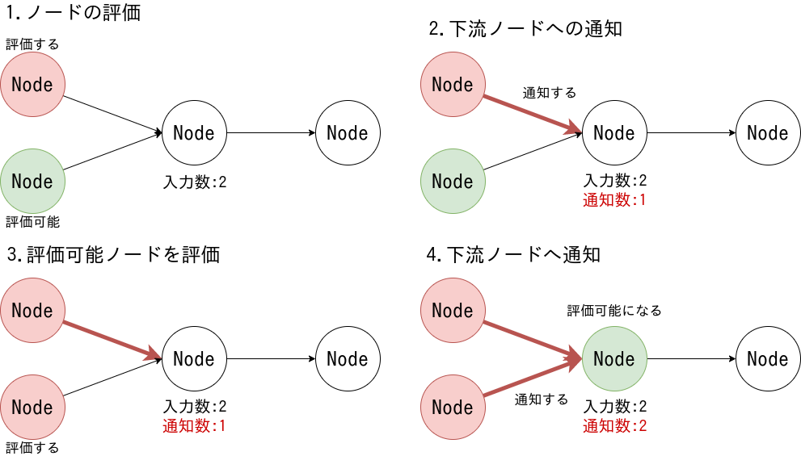

<!-- 
theme: default
size: 16:9
paginate: true
footer :  [licence](https://creativecommons.org/licenses/by-sa/4.0/)
style: |
  h1, h2, h3, h4, h5, header, footer {
        color: white;
    }
  section {
    background-color: #505050;
    color:white
  }
  table{
      color:black
  }
  code{
    color:black
  }
  a {
    font-weight:bold;
    color:#F00;
  } 
-->

<!-- page_number: true -->

# TFHE実装入門

## 9.Chisel&Yosys

松岡　航太郎

---

## このスライドで話すこと

- TFHEは論理ゲートの処理をサポートする
- ∴処理したい関数を論理回路で表現する必要がある
- 実際のハードウェアで使用する方法を流用する
- ネットリストを生成してその形式の説明まで

---

## Chiselとは

- Hardware Description Language(HDL)の一つ
- メジャーなHDLであるVerilogにトランスパイルされる
- RISC Vのコアを記述するために作られた
- モダンで比較的書きやすい
- Scala上のDSLとして実装されている
- Scalaでシミュレーションができる
- この段階では論理ゲートはでてこない
- 回路が満たすべき仕様を記述する

---

## Chiselの例(Counter)
- ソースコードは../src/main/scalaの下に置く

```
import chisel3._
class Counter extends Module {//本体
  val io = IO(new Bundle {//IOの定義
    val amt = Input(UInt(4.W))
    val tot = Output(UInt(8.W))
  })

  val cnt = RegInit(0.U(8.W))//8bitのレジスタをカウンタとして持つ
  cnt := cnt + io.amt//1クロックごとにamtだけインクリメント

  io.tot := cnt //レジスタをそのまま出力として吐く
}

object Elaborate extends App {
  chisel3.Driver.execute(args, () => new Counter()) //Counterをverilogに吐く対象として設定
}
```

---

## Yosys

- オープンソースの論理合成ソフト
- Verilog以外も入力に取れる
- HDLから論理ゲートのネットリストを生成する
- オプションはいろいろあるが既存品の流用が賢明か
- TFHEでは二入力の論理ゲートとMUXしかないのでそのことを伝えるのが大事
- abc -g gates,MUX
- abcはバークレーの論理合成ソフトでYosysは実質フロントエンド

---

## ネットリスト

- ネットリストとは端子間の接続を記述したデータのこと
- ここでは論理回路の表現
- Yosysは複数の形式でネットリストを吐くことができる
- ここでは講師が利用しているJSONネットリストの形式を扱う
- ネットリストをパースしそれに基づいてTFHEのゲートを実行すればいい

---

## JSONネットリスト形式(全体像)
- [公式](http://www.clifford.at/yosys/cmd_write_json.html)からとってきたがもうちょい管理用の情報みたいなのも出てくる

```
{
  "modules": {
    <module_name>: {
      "ports": {
        <port_name>: <port_details>,
        ...
      },
      "cells": {
        <cell_name>: <cell_details>,
        ...
      },
      "netnames": {
        <net_name>: <net_details>,
        ...
      }
    }
  },
  "models": {
    ...
  },
}
```

---

## JSONネットリスト形式(port)

- directionを見て種類を判別
- bit_vectorに入っている番号をその種類へ登録

```
{
  "direction": <"input" | "output" | "inout">,
  "bits": <bit_vector>
}
```

---

## JSONネットリスト形式(cell)
- cell_typeは"\$\_AND\_"のような形式
- port_directionにはどのポートがどの向きかが書いてある
- connectionsには実際どの線につながっているかが書いてある
- 同じ線につながっている異なるセルのポートはつながっている

```
{
  "type": <cell_type>,
  "port_directions": {
    <port_name>: <"input" | "output" | "inout">,
    ...
  },
  "connections": {
    <port_name>: <bit_vector>,
    ...
  },
}
```

---

## ポートの扱いに関して

- Chiselを使うとclockとresetが必ず存在するが基本的にはこの２つは無視して良い
- clockはDFFにデータを取り込むタイミングを制御するがそれは実行エンジンで決められる
- resetはDFFの中身の初期化を制御するが電源投入とかないのでまず使わない

---

## ゲートの扱いについて

- 入力の片方が否定で入ってくるゲートがいるがTFHEppだと次のような対応になる
- "\$\_ANDNOT_" ₌₌ HomANDYN
- MUXに関してはS?B:Aの関係

---

## DFFの扱いに関して

- DFFは暗号文を保持するだけでいいのでフリップフロップとかはいらない
- 実行エンジン側で暗号文を保持するメモリを用意すればそれでいい
- DAGとして表現しないと扱いづらいのでDFFのDポートを出力ポート、Qポートを入力ポートとして登録する
- 1クロックの終了ごとにDポートのデータをQポートにコピーすればDFFになる

---

## タスク発行のイメージ

- 講師とチュータの未踏の成果報告書の図



---

## Iyokan

- 未踏で作った論理回路を実行するエンジン
- JSONを読みやすいグラフ構造に変換するIyokan-L1
- 実際にそれに基づいて実行するIyokanの２層構造
- cuFHEによるGPU実行やCMUX Memoryに対応

---

## Sudachi

- 次世代のIyokanのPoC
- Iyokanと違って実行エンジン本体は[CppTaskflow](https://github.com/taskflow/taskflow)に投げている
- 小さいので参考にしやすいか？

---

## V2TT

- 一番最初に作った実行エンジン
- OpenMPを使ったC++のコードを吐くトランスパイラ
- 大変不評だったので真似しないほうがいい
