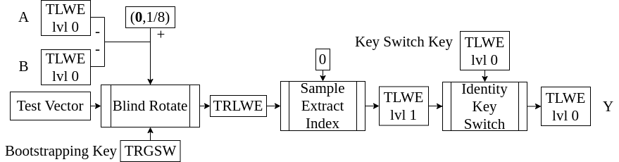

<!-- 
theme: default
size: 16:9
paginate: true
footer :  [licence](https://creativecommons.org/licenses/by-sa/4.0/)
style: |
  h1, h2, h3, h4, h5, header, footer {
        color: white;
    }
  section {
    background-color: #505050;
    color:white
  }
  table{
      color:black
  }
  code{
    color:black
  }
    a {
    font-weight:bold;
    color:#F00;
  } 
-->

<!-- page_number: true -->

# 完全準同型暗号入門

佐藤研究室 松岡　航太郎
matusoka.kotaro@gmail.com

---

## 準同型暗号とは？

- 「暗号文のママ計算できる」暗号
- 平文に対する演算と準同型な演算を暗号上で定義できる
- 概念が提案されたのは1978年(RSAと同年)
- DARPA、Intel、IBM、Microsftなどが鎬を削っている
- 他の秘密計算の手法である秘密分散、Garbled Circuit、TEEとは状況に応じて使い分けられる
- 流行りの応用は医療データなどの機密性の高いデータを扱うPrivate AI

---

## 準同型暗号の例: RSA暗号

- $p,q∈ℙ,n=pq,e≤ϕ(n)=(p-1)(q-1),d=e⁻¹ \bmod n$とする
- $c,m$を暗号文と平文を示すものとする
- 暗号化: $c ≡ mᵉ \bmod n$, 復号 $mᵈ \bmod n$'
- 実はこれが乗算について準同型暗号になっていることを見よう
- すなわち、２つの暗号文を掛け算して復号すると平文の掛け算が得られる
- $(c_1 ⋅ c_2)^d = (m_1^e ⋅ m_2^e)^d = (m_1⋅m_2)^{ed} ≡ m_1⋅m_2 \bmod n$

---

## 準同型暗号の種類

今日では以下の4つに分けられる   
基本的に上に行くほど制限が強く、下に行くほど計算が重い

- 部分(Partially)準同型暗号 (PHE): 加算か乗算だけをサポートするもの
    - ex. RSA暗号、ElGamal暗号、Paillier暗号など
- Somewhat HE: 両方できるが演算回数に暗号形式に依存した制限が在るもの
    - 格子ベースでないものは知る限りではここが限界
- Leveled HE: 演算回数の制限がパラメータで変更できるもの
    - 暗号上で評価する関数の空間を暗号化時に制限する必要が在る
- 完全(Fully)準同型暗号: 任意の関数が評価できる
    - 知られているものは格子ベース
    - 今日の本題なので詳しくは後述

---

## Learning With Error (LWE)

- 最もよく知られている格子暗号でNP困難なShort Vector Problemに依拠する(提案はRegevさんの2005年)
- これの拡張が耐量子暗号の候補として[NIST Round3](https://csrc.nist.gov/projects/post-quantum-cryptography/round-3-submissions)まで生き残っている
- ここでは全係数が剰余環上にとられるInteger LWEを紹介する
- $n,q∈ℤ^+$を公開パラメータ、$\mathbf{s}∈ℤ^n,\mathbf{a}∈ℤ_q^n$は各係数が一様分布、$e∈ℤ_q$は正規分布に従って取られるものとする
- $\mathbf{s}$は秘密鍵で、$e$はエラー(またはノイズ)
- $ℤ_q∋b=\mathbf{a}⋅\mathbf{s}+m+e$として、$(\mathbf{a},b)$の組が暗号文
- 復号は$b-\mathbf{a}⋅\mathbf{s}=m+e$から一番近いあり得る平文に丸める

---

## LWEの加法準同型性

- 実はLWEはそのままでも加法が定義できることを確認する
- $(\mathbf{a}_1,b_1)+(\mathbf{a}_2,b_2)=(\mathbf{a}_1+\mathbf{a}_2,b_1+b_2)$とする
$$\begin{aligned}(b_1+b_2)-(\mathbf{a}_1+\mathbf{a}_2)⋅\mathbf{s}&=(b_1-\mathbf{a}_1⋅\mathbf{s})+(b_2-\mathbf{a}_2⋅\mathbf{s})\\&=m_1+m_2+e_1+e_2\end{aligned}$$
- ここで重要なのは加法によってエラー$e$も増えること
- 復号では丸めを行うのでエラーが増えすぎると誤ったメッセージに丸める可能性が在る
- ∴任意の関数を評価するにはエラーを除去する必要が在る

---

## Bootstrapping

- 準同型暗号上で復号関数を評価することでエラーを除去する操作のこと
- Gentryさんはこれを最初に提案し、構成を与えた
- 現状の完全準同型暗号は全てこれによって構成されている
- あとでTFHEにおけるBootstrappingのアイデアを見る

---

## 完全準同型暗号

以下の4つの世代に分けられる
- 第１世代: SHEを使ってBootstrappingを構成したもの
  - 効率の問題などで現実に用いられることはほぼない
- 第２世代:  剰余環上の乗算と加算をサポートするもの
  - 第２世代を構成する過程でLHEが作られ、以降はそれをベースとしている
  - ex. BGV(Brakerski-Gentry-Vaikuntanathan),BFV(Brakerski/Fan-Vercauteren)
- 第３世代: バイナリ演算をサポートするもの
  - Bootstrappingが他の世代に比して高速(1000倍のオーダ)
  - ex. GSW(Gentry-Sahai-Waters),TFHE(Torus FHE)
- 第４世代: 有限精度複素数演算をサポートするもの
  - 実数が扱えるので深層学習用途に人気
  - ex. CKKS(Cheon-Kim-Kim-Song)

---

## TFHE

- 第３世代FHEの一つ
- 知られている中で最も高速なBootstrapping(10msオーダ)
- バイナリ演算以外の非線形演算の評価にも適している(ReLUなど)
- VSPではプロセッサ回路の評価に使用

---
## Torus

- 円周群のこと(複素数平面の単位円上の点がなす群)
- ここでは$\mathbb{R} \bmod 1$を定義とする。つまり、実数の小数部分で、$[0,1)$または$[-0.5,0.5)$に値をとる
- Torusの集合を$𝕋$と書く
- 加算の例: $0.8+0.6=1.4≡0.4 \bmod 1,0.3-0.9=-0.6 ≡ 0.4 \bmod 1$
- 乗算は定義できない。$1.2≡0.2 \bmod 1,2.4≡0.4 \bmod 1$なので、乗算が定義できるなら$1.2⋅ 2.4=2.88≡0.2⋅0.4=0.08\bmod 1$だが成立しない。
- 整数($\mathbb{Z}$)との乗算は定義できる例$3⋅ 0.4≡ 0.2 \bmod 1$
- 実装レベルでは、32bitないし64bit整数を固定小数点数として使う

---

## TLWE

- Torus版のLWE
- 全ての係数がTorusのもの(つまり平文もエラーもTorus)
- 秘密鍵は$ℤ^n$なので$\mathbf{a}⋅\mathbf{s}$は問題なく計算できる
- 実際にはTFHEでは高速化のために$\mathbf{s}∈𝔹^n$にとる
- 実装としては$q=2^{32}$などにとったInteger LWEと同じになる
- $q$の選択を忘れられるので理論として綺麗になる

---

## TFHEにおけるメッセージエンコードの仕方

- 復号で丸めをするのでメッセージ空間を制限する必要が在る
- TFHEでは0と1を表現させたい($m_b∈𝔹$とする)
- これをTorusの平文として$m=(2m_b-1)/8∈𝕋$にエンコードする
- 8で割る理由は次スライド
- 復号は$(1+\mathit{sgn}(b-\mathbf{a}\cdot\mathbf{s}))/2$
- 符号関数$\mathit{sgn}$が丸めになっている

---
## バイナリ演算のアイデア

- Torusにエンコードされた平文は{-1/8,1/8}
- ２つのTLWEを足したものの平文は{-1/4,0,1/4}
- これに(\mathbf{0},-1/8)を足すと{-3/8,-1/8,1/8}
- -3/8になるのは両方の暗号文がバイナリの平文として0のとき
- 1/8は両方1、-1/8は２つが異なる
- この暗号文を復号すると、負符号のものは0に、正符号は1になる
- つまり、両方1の暗号文を入力としたときだけ1になるのでANDになっている
- Remark: Bootstrappingは暗号上で復号を評価する

---

## HomNAND

- Bootstrappingを使ってNANDを評価する方法
- 任意の２入力ゲートは足し算の符号と定数を変えることで構成可能
- TFHEで実際に復号を評価するためのアイデアを見ていく



---

## TRLWE

- Ring版のTLWE
- ここで言うRingは多項式環のこと
- TFHEでは$N∈ℤ^+$を公開パラメータとして$X^N+1$で割った余りを考える
- 原則的には$N$は2のべき乗である(円分多項式は有理数の範囲で既約)
- Torus係数多項式を$X^N+1$で割った余りの成す環を$𝕋_N[X]$と書く
- 平文とエラーは$m[X],e[X]∈𝕋_N[X]$となり、秘密鍵も$s[X]∈ℤ_N[X]$となる
- 暗号文は$b[X]=a[X]⋅s[X]+m[X]+e[X]$として$(a[X],b[X])$
- 復号は$b[X]-a[X]⋅s[X]$を各係数ごとに丸める

---

## Blind Rotateのアイデア

- 問題は符号関数という非線形関数をどうやって評価するか
- 重要な事実は、$𝕋_N[X]∋p[X]=∑_{i=0}^{N-1}p_iX^i$とすると
$X⋅p[X]≡-p_{N-1}+∑_{i=0}^{N-2}p_iX^{i+1} \bmod X^N+1$
$X^{2N}⋅p[X]≡p[X] \bmod X^N+1$
$X^f⋅X^g⋅p[X] ≡ X^{f+g \bmod 2N}⋅p[X] \bmod X^N+1$
- 入力となるTLWEを$(\mathbf{a},b)$、$[-N,N)∋ρ=⌈2N⋅b⌋ - ∑_{i=0}^{N-1}⌈2N⋅a_i⌋ \bmod 2N$とする
- 全ての係数が$1/8$である多項式を$t[X]∈𝕋_N[X]$とする
- $X^{-ρ}⋅t[X]$の定数項の符号は$ρ$($≈b-\mathbf{a}⋅\mathbf{s}$)の符号と同じになる
- あとは定数項を取り出せば(Sample Extract Index)符号関数を評価できる

---

## TRGSW

- Torus版Ring版 GSW(最初の第3世代FHE)
- この暗号文形式が在るのがTFHEが第３世代である所以とも言える
- 説明しだすと長いので詳細は省略
- 平文が$μ[X]∈ℤ[X]$に取られることと、以下の演算が定義されることだけが大事
- 実際には$μ[X]$は$𝔹$にとられる(理由は次のスライド)

## External Product

TRGSW⊡TRLWE→TRLWE
- 平文の計算としては$μ[X]⋅m[X]$

---

## CMUX

- $\mathbf{C}$を平文が$𝔹$なTRGSW、$c_1[X],c_0[X]$をTRLWEとする
- 以下の計算は$\mathbf{C}$の平文が1なら$c_1[X]$を、0なら$c_0[X]$を返す
$\mathbf{C}⊡(c_1[X]-c_0[X])+c_0[X]$
- これを使いたいので平文は$𝔹$だけでよい

---

## CMUXを使ったBlind Rotateの構成

- Remark: TRLWEの$a[X],b[X]$をそれぞれX倍すると平文もX倍される
- 前に述べたように、$\mathbf{s}∈𝔹^n$にTFHEは制限している
- $\mathbf{BK}_i$を$\mathbf{s}$の$i$番目の係数を平文とするTRGSWとする
- $X^{-ρ}⋅t[X]$は以下のような疑似コードで暗号上で計算することができる
- Remark: 出力のエラーは入力のTLWEのエラーに依存しない
```
BlindRotaete((𝐚,b),𝐁𝐊
  b̃=2N-⌈2N⋅b⌋
  trlwe = (\mathbf{0},X⁻ᵇ̃⋅t[X])
  for i from 0 to n-1
    ã=⌈2N⋅aᵢ⌋
    trlwe = CMUX(𝐁𝐊ᵢ,Xᵃ̃⋅trlwe,trlwe)//Dec(𝐁𝐊ᵢ)?Xᵃ̃⋅trlwe:trlwe
  return trlwe
```

---

## Sample Extract Index

- 任意の次数の係数をTRLWEから取り出してTLWEを構成する操作
- $b[X]-a[X]⋅s[X]$の$k$次の係数は以下のように書ける
$b_k-(∑_{i+j=k,0≤i,j≤N-1}a_i⋅s_j)-(∑_{i+j=N+k,0≤i,j≤N-1}-a_i⋅s_j)$
- $\mathbf{s}'$は$s[X]$の$i$次の係数を$i$番目の要素とするベクトル
- $0$次の係数を取り出したTLWEを$(\mathbf{a}',b_0)$とすると$\mathbf{a}'$の要素は$a_0'=a_0,a_i'=a_{N-i}$
- これは$b_0-\mathbf{a}'⋅\mathbf{s}'$が上の式で$k=0$とした場合と同じになっている
- このTLWEは$\mathbf{a}'$の次数が$n$ではなく$N$になっている
- これを変換するのがIdentity Key Switch

---

## Identity Key Switch

- Key SwitchはTLWEを異なる秘密鍵のTLWEへと変換する操作($\mathbf{s}'→\mathbf{s}$)
- 基本的なアイデアは$b'-∑_{i=0}^{N-1}2^{-t}⌈2^t⋅a_i'⋅s_i'⌋$を暗号上で計算すること
- KSᵢⱼを$\mathbf{s}$を秘密鍵、$2^{-j}⋅s'_i$を平文とするTLWEとする
```
IdentityKeySwitch((𝐚',b'),𝐊𝐒)
  b̃=b'
  for i from 0 to n
    ãᵢ = 0
  for i from 0 to N
    for j from 0 to t-1
      (𝐚̃,b̃) -= (⌊aᵢ'*2ʲ⁺¹⌋ mod 2) ⋅ KSᵢⱼ
  return (𝐚̃,b̃)
```

---

## HomNAND(再掲)

- これらを全てつなげるとNANDが評価できる
- 説明しなかったのはTRGSWの話だけ(一番面倒では在る)


---

## 準同型暗号の展望

- TFHEのゲートは10msかかるので物理論理ゲートに比べると10⁹ほど遅い
- 他の準同型暗号も平文の演算に比べるとずっと遅い
- DARPAはこれを専用ハードウェアで押し切ろうとしている
- そもそもまだ暗号学的改善の余地も在る
- [標準化](https://homomorphicencryption.org/standard/)の動きも在る
- 謎の準同型暗号ベンチャーは雨後の筍状態
- 理論的な問題としてはMalleabilityの問題が在る
- 準同型暗号は秘密計算の「聖杯」≠「銀の弾丸」